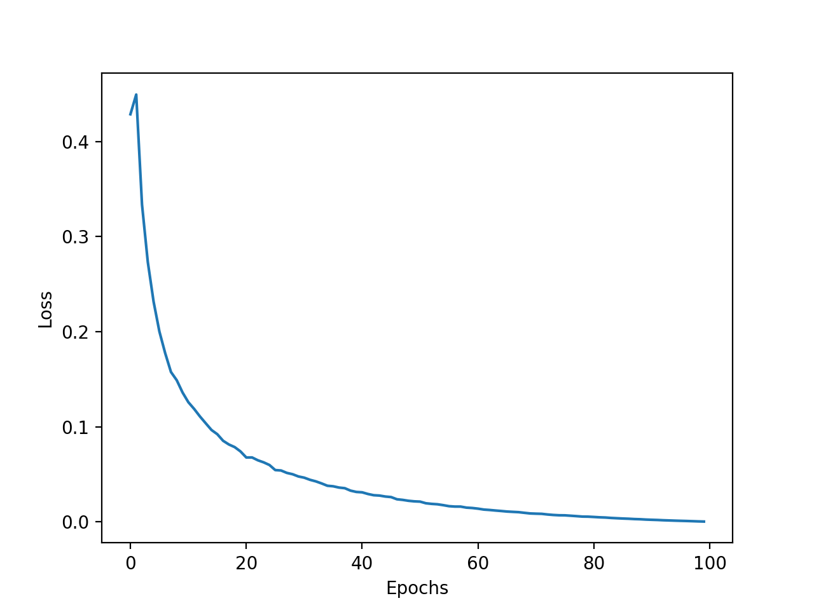
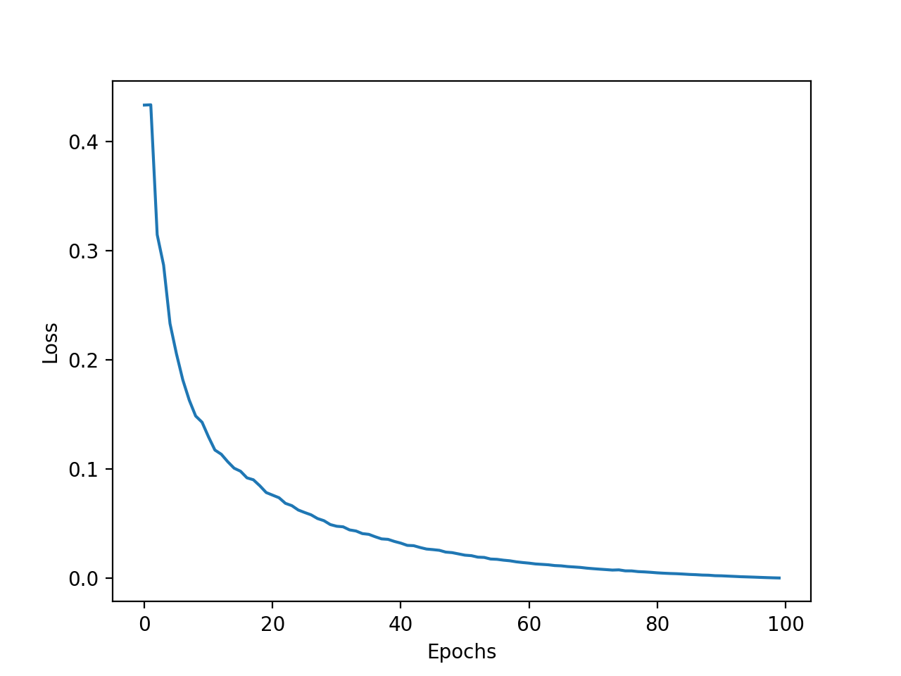
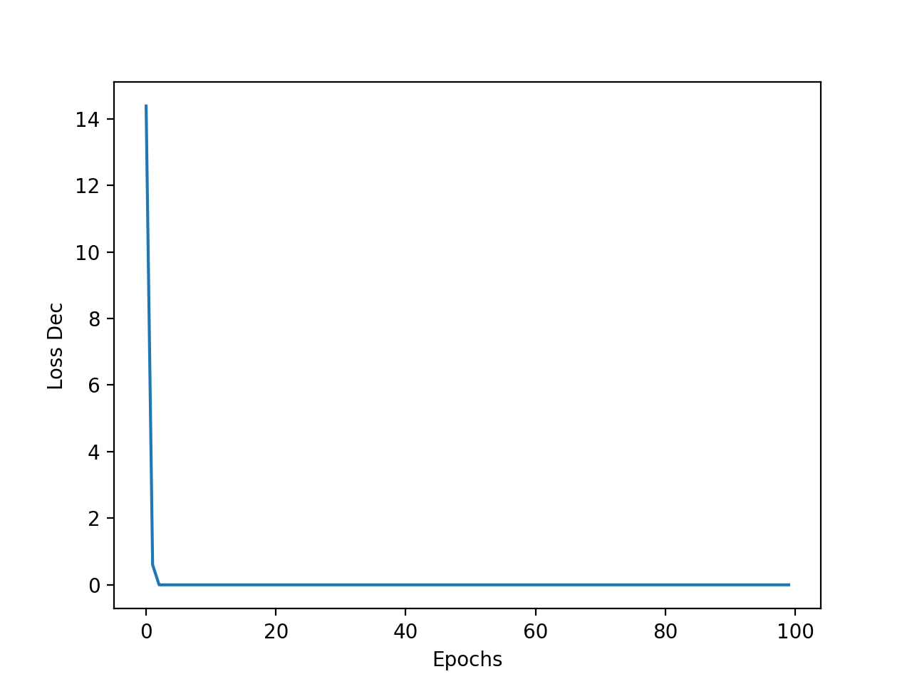
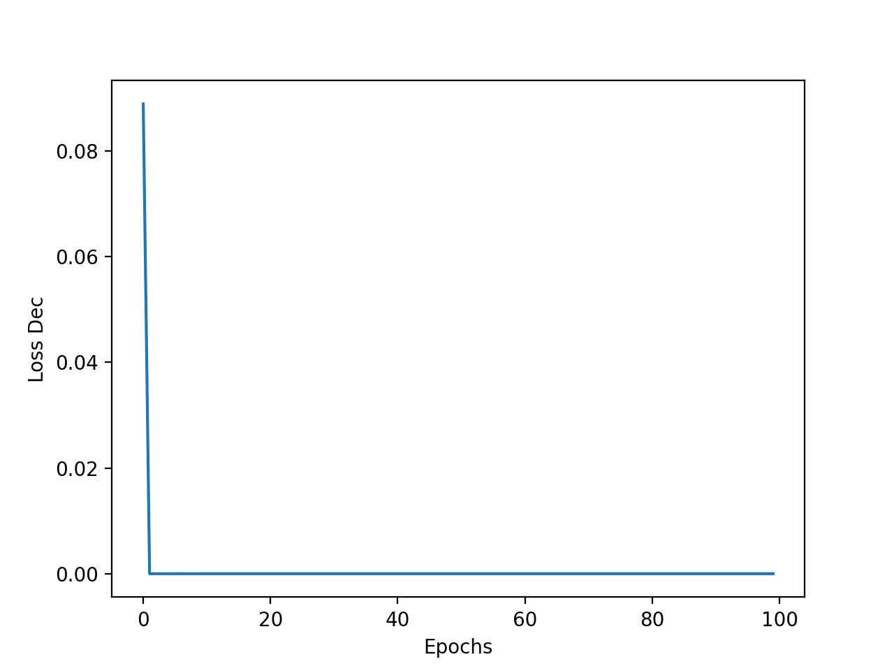
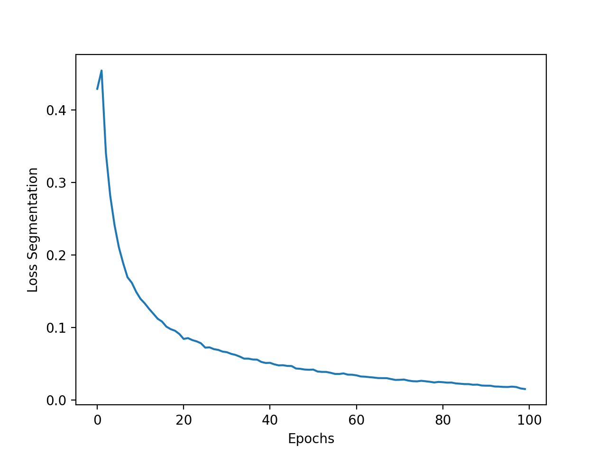
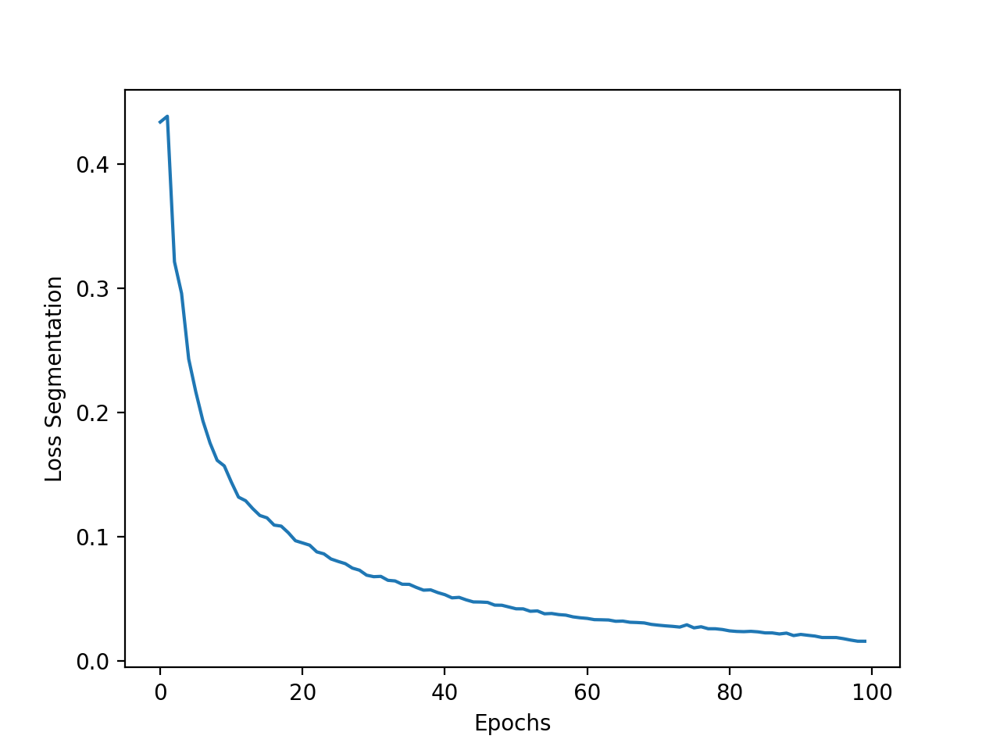
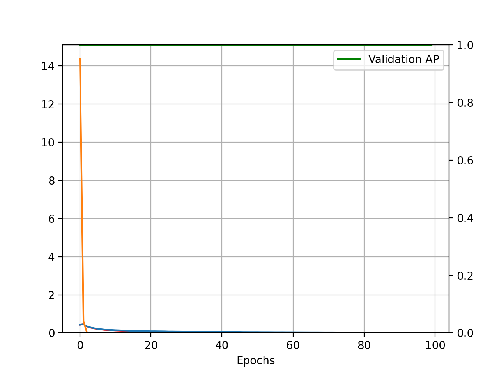
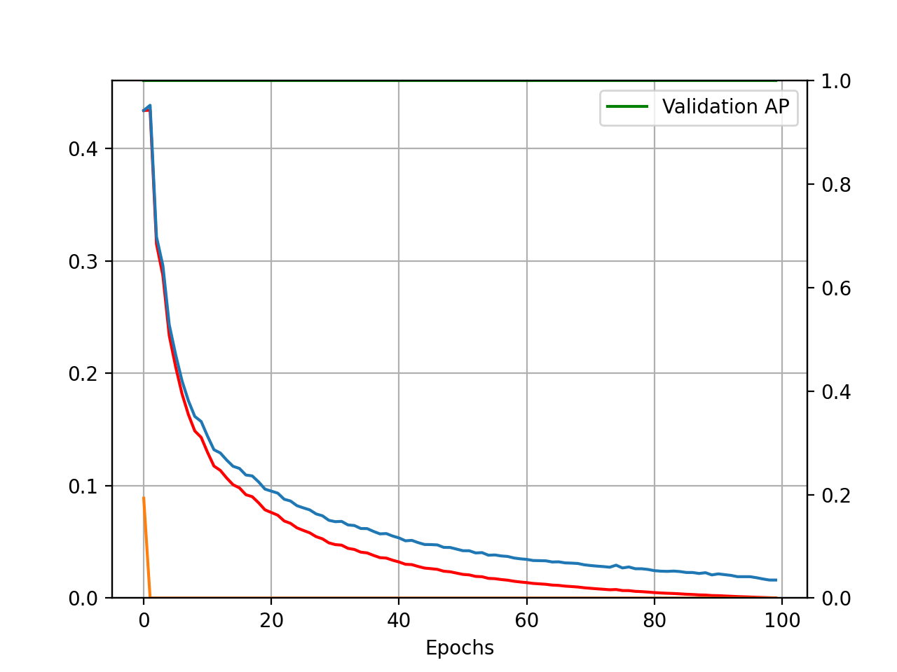
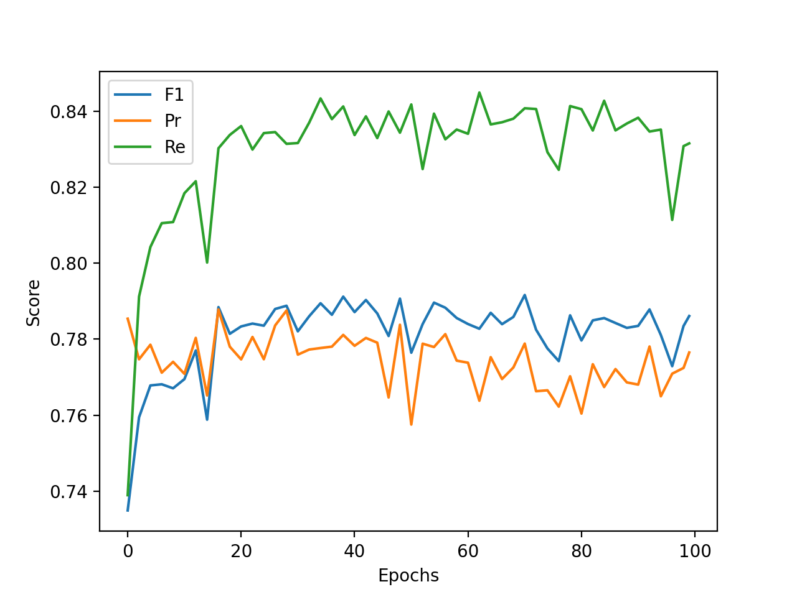
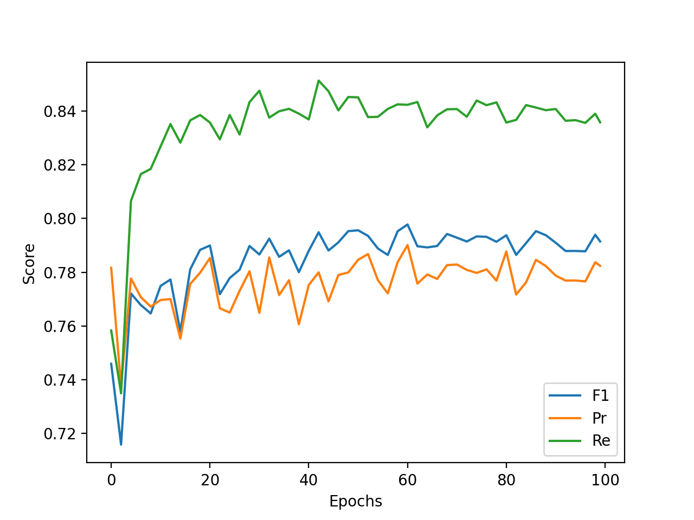

# Results of training on CRACK500 dataset

[Članek](https://ieeexplore.ieee.org/stamp/stamp.jsp?tp=&arnumber=9680172)

[Pregled vseh člankov](https://docs.google.com/spreadsheets/d/1AUmJ-JQtpvQt3Rs0maRirAxbBW6zBOBaPq1kVDSdvK0/edit?usp=sharing)

[Dataset](https://github.com/fyangneil/pavement-crack-detection)

## Dataset

| Parameter         | Value       |
| -----------       | ----------- |
| Input channels    | 3           |
| Input height      | 360         |
| Input width       | 640         |
| Train samples     | 1896        |
| Test samples      | 1124        |
| Validation samples| 348         |

| Set         | Positives   | Negatives   |
| ----------- | ----------- | ----------- |
| Train       | 1896        | 0           |
| Test        | 1124        | 0           |
| Validation  | 348         | 0           |

## Run parameters

Za vse run-e so bili uporabljeni parametri.

| Parameter                      | Value       |
| -----------                    | ----------- |
| Optimizer                      | Adam        |
| Learning rate                  | 0.001       |
| Delta CLS Loss                 | 0.01        |
| Epochs                         | 100         |
| Batch size                     | 10          |
| Dilate                         | 1           |
| Weighted segmentation loss     | False       |
| Dynamically balanced loss      | True        |
| Gradien-flow adjustment        | True        |
| Frequency-of-use sampling      | False       |
| Validate                       | True        |
| Validate on test               | False       |
| Validataton N epochs           | 2           |
| Use best model                 | True        |
| Best model type                | seg         |
| Augmentation                   | True        |

## Difficulty score

#### nm_1
- difficulty_score = loss_seg

#### nm_2
- difficulty_score = loss_seg * ((2 * fp) + fn + 1)

### Decision

| Run       | Precision | Recall   | F1       | Accuracy | TP   | FP   | FN   | TN   | Threshold   |
| ----------| ----------| ---------| ---------|----------|------|------|------|------|-------------|
| nm_1      | 0         | 0        | 0        | 0        | 0    | 0    | 1124 | 0    | 1.0         |
| nm_2      | 0         | 0        | 0        | 0        | 0    | 0    | 1124 | 0    | 1.0         |

### Segmentation 2 pixel distance

| Run       | Precision     | Recall       | F1           | Threshold |
| ----------| --------------| -------------| -------------|-----------|
| nm_1      | 0.711602      | 0.797762     | 0.730465     | 0.38      |
| nm_2      | 0.723293      | 0.795270     | 0.736452     | 0.425     |

## Losses

### Loss

| nm_1                     | nm_2                     |
| ------------------------ | ------------------------ |
|  |  |

### Decision Loss

| nm_1                         | nm_2                         |
| ---------------------------- | ---------------------------- |
|  |  |

### Segmentation Loss

| nm_1                         | nm_2                         |
| ---------------------------- | ---------------------------- |
|  |  |

### Val Loss

| nm_1                         | nm_2                         |
| ---------------------------- | ---------------------------- |
|  |  |

### Scores

| nm_1                         | nm_2                         |
| ---------------------------- | ---------------------------- |
|  |  |

### Outputs

[nm_1](./nm_1/nm_1.out)

[nm_2](./nm_2/nm_2.out)