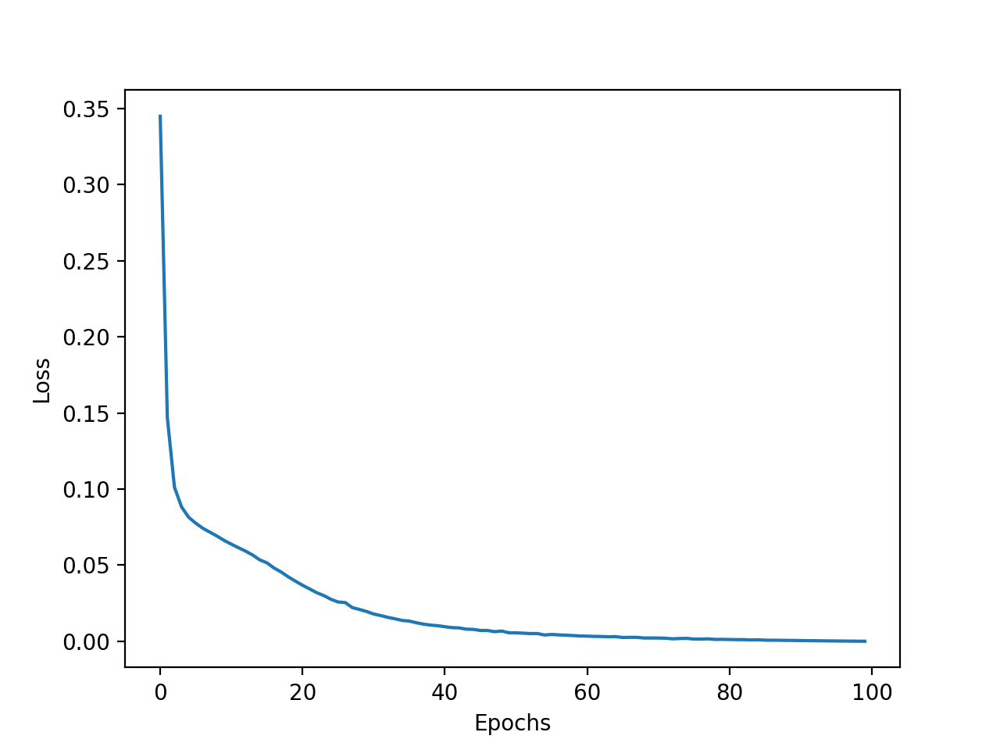
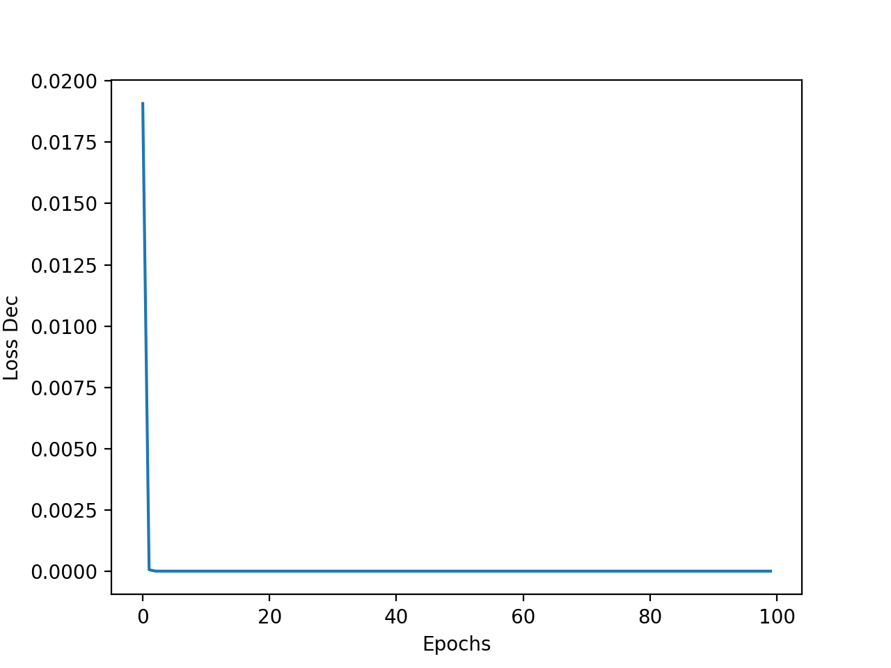
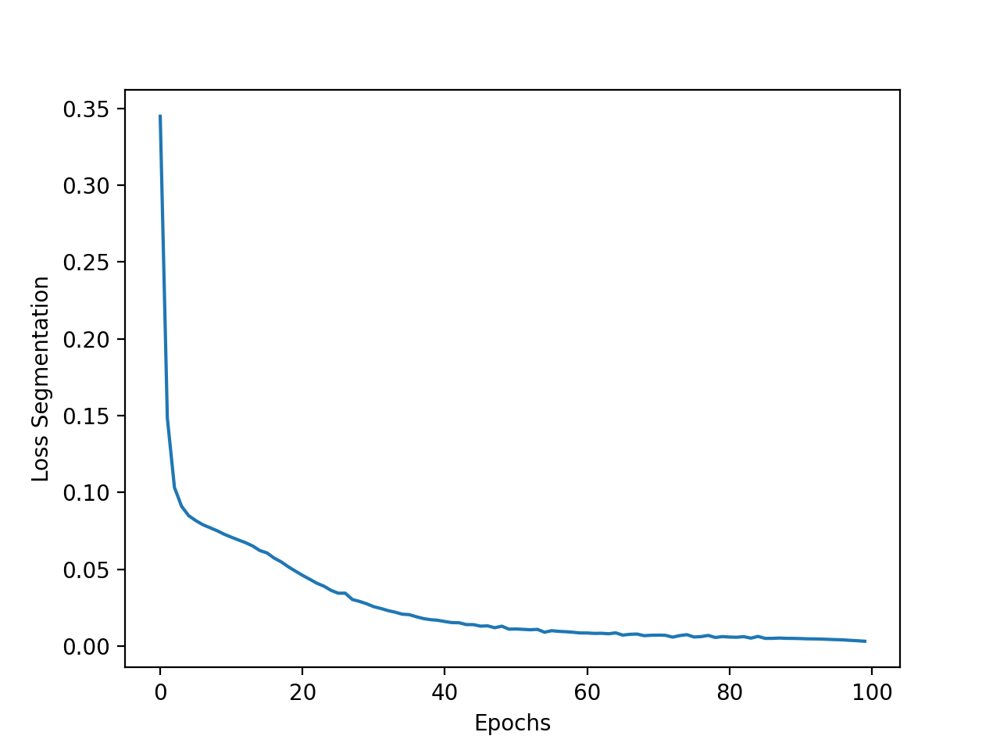
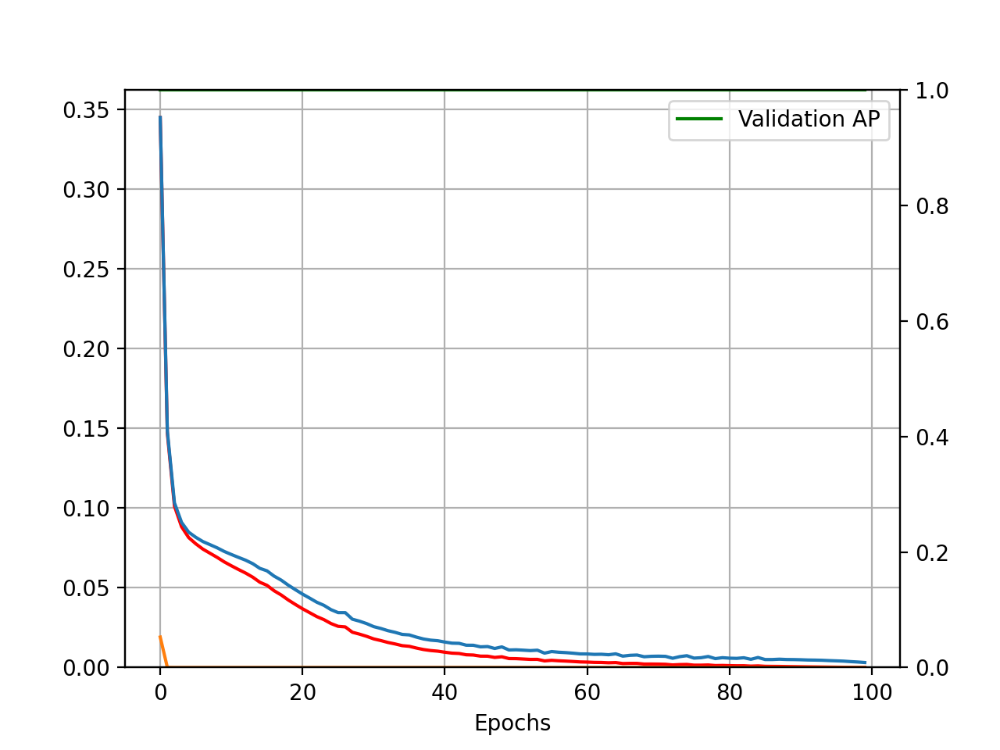
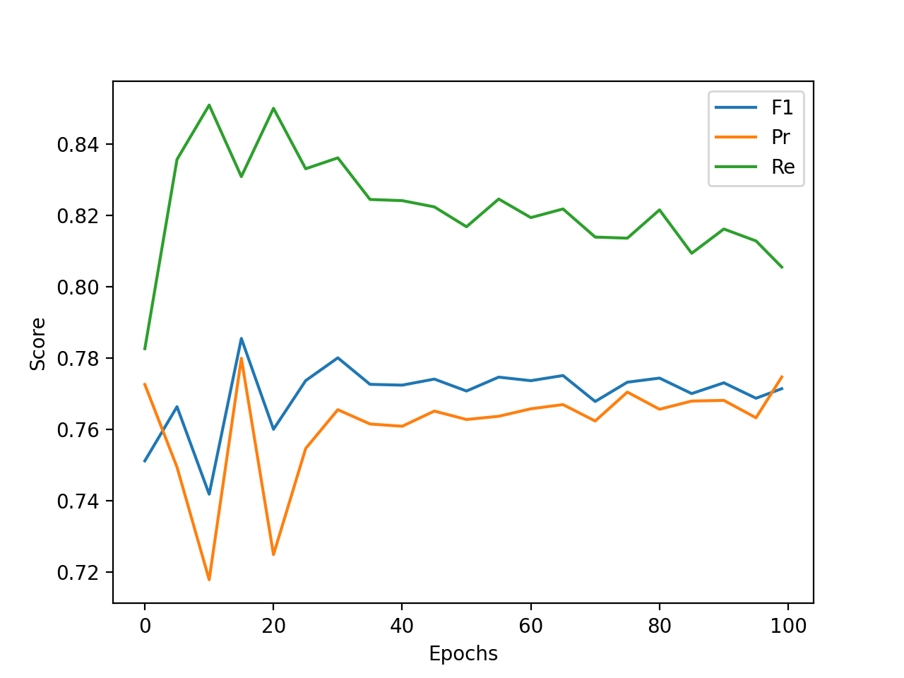

# Results of training on CRACK500 dataset

[Članek](https://ieeexplore.ieee.org/stamp/stamp.jsp?tp=&arnumber=9680172)

[Pregled vseh člankov](https://docs.google.com/spreadsheets/d/1AUmJ-JQtpvQt3Rs0maRirAxbBW6zBOBaPq1kVDSdvK0/edit?usp=sharing)

[Dataset](https://github.com/fyangneil/pavement-crack-detection)

[Vizualizacija testnih primerov](https://drive.google.com/drive/folders/1yeKVZYAYTuExjdzxdedGIyY1DWBKadk9?usp=sharing)

## Dataset

| Parameter         | Value       |
| -----------       | ----------- |
| Input channels    | 3           |
| Input height      | 360         |
| Input width       | 640         |
| Train samples     | 1896        |
| Test samples      | 1124        |
| Validation samples| 348         |

| Set         | Positives   | Negatives   |  Sum        |
| ----------- | ----------- | ----------- | ----------- |
| Train       | 1896        | 0           | 1896        |
| Test        | 1124        | 0           | 1124        |
| Validation  | 348         | 0           | 348         |
| **Sum**     | 3368        | 0           | 3368        |

## Run parameters

| Parameter                      | Value       |
| -----------                    | ----------- |
| Batch size                     | 1           |
| Epochs                         | 100         |
| Learning rate                  | 0.001       |
| Delta CLS Loss                 | 0.01        |
| Dilate                         | 1           |
| Dynamically balanced loss      | True        |
| Gradien-flow adjustment        | True        |
| Frequency-of-use sampling      | False       |
| Weighted segmentation loss     | False       |
| Use best model                 | True        |
| Best model type                | seg         |
| Validate                       | True        |
| Validate on test               | False       |
| Augmentation                   | False       |
| Optimizer                      | Adam        |
| Use negatives                  | False       |
| Hard negative mining           | 0.2         |

### Decision
| Precision | Recall   | F1       | Accuracy | Threshold | TP   | FP   | FN   | TN   |
| ----------| ---------| ---------|----------|-----------|------|------|------|------|
| 0         | 0        | 0        | 0        | 1         | 0    | 0    | 1124 | 0    |

### 2 pixel distance
| Precision     | Recall       | F1           | Threshold |
| --------------| -------------| -------------|-----------|
| 0.715461      | 0.790557     | 0.730140     | 0.475     |

## Losses

## Scores

### Output

[Output](./crack500_run6_7.out)