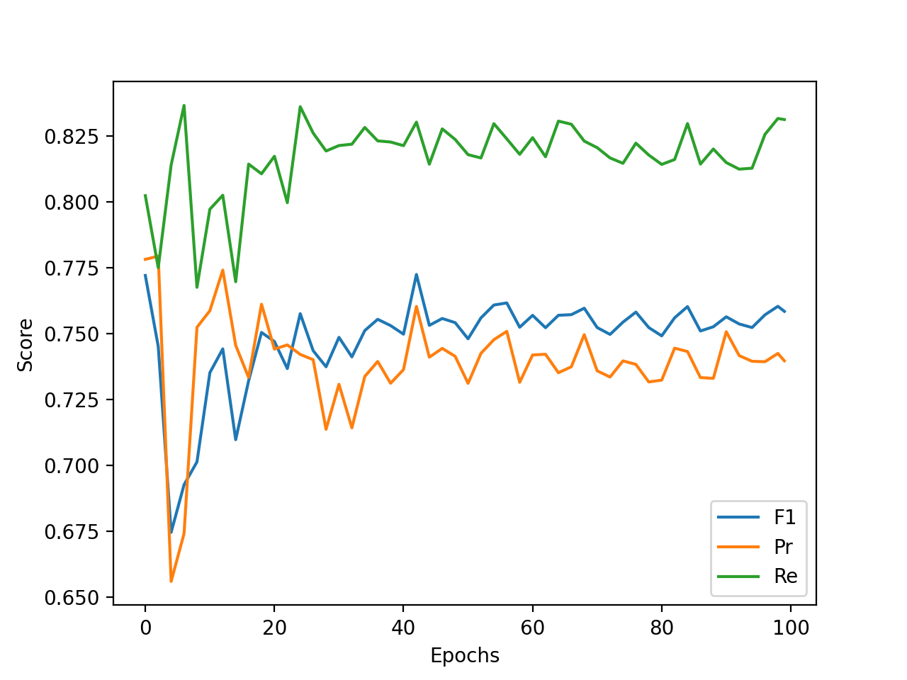

# Results of training on CRACK500 dataset

[Članek](https://ieeexplore.ieee.org/stamp/stamp.jsp?tp=&arnumber=9680172)

[Pregled vseh člankov](https://docs.google.com/spreadsheets/d/1AUmJ-JQtpvQt3Rs0maRirAxbBW6zBOBaPq1kVDSdvK0/edit?usp=sharing)

[Dataset](https://github.com/fyangneil/pavement-crack-detection)

## Dataset

| Parameter         | Value       |
| -----------       | ----------- |
| Input channels    | 3           |
| Input height      | 360         |
| Input width       | 640         |
| Train samples     | 1896        |
| Test samples      | 1124        |
| Validation samples| 348         |

| Set         | Positives   | Negatives   |
| ----------- | ----------- | ----------- |
| Train       | 1896        | 0           |
| Test        | 1124        | 0           |
| Validation  | 348         | 0           |

## Runs Resolution

| Run         | Train - Resolution  | Train - Positives   | Train - Negatives   | Train Sum   | Augmentation  | Use negatives | Hard negative mining |
| ----------- | ------------------- | ------------------- | ------------------- | ----------- | ------------- | ------------- | -------------------- |
| run8        | 480x270             | 1896                | 757                 | 2653        | True          | True          | -                    |
| run8_2      | 480x270             | 1896                | 757                 | 2653        | True          | True          | 5 0.1                |
| run8_3      | 320x180             | 1896                | 1682                | 3578        | True          | True          | -                    |
| run8_5      | 320x180             | 1896                | 1682                | 3578        | True          | True          | 5 0.1                |

## Run parameters

Za vse run-e so bili uporabljeni parametri.

| Parameter                      | Value       |
| -----------                    | ----------- |
| Batch size                     | 10          |
| Epochs                         | 100         |
| Learning rate                  | 0.001       |
| Delta CLS Loss                 | 0.01        |
| Dilate                         | 1           |
| Dynamically balanced loss      | True        |
| Gradien-flow adjustment        | True        |
| Frequency-of-use sampling      | False       |
| Weighted segmentation loss     | False       |
| Use best model                 | True        |
| Best model type                | seg         |
| Validate                       | True        |
| Validataton N epochs           | 2           |
| Validate on test               | False       |
| Optimizer                      | Adam        |

### Decision

| Run       | Precision | Recall   | F1       | Accuracy | TP   | FP   | FN   | TN   |
| ----------| ----------| ---------| ---------|----------|------|------|------|------|
| run8      | 1.0       | 0.993772 | 0.996876 | 0.993772 | 1117 | 0    | 7    | 0    |
| run8_2    | 1.0       | 1.0      | 1.0      | 1.0      | 1124 | 0    | 0    | 0    |
| run8_3    | 1.0       | 0.995552 | 0.997771 | 0.995552 | 1119 | 0    | 5    | 0    |
| run8_5    | 1.0       | 0.999110 | 0.999555 | 0.999110 | 1123 | 0    | 1    | 0    |

### Segmentation 2 pixel distance

| Run     | Precision     | Recall       | F1           | Threshold |
| --------| --------------| -------------| -------------|-----------|
| run8    | 0.744823      | 0.803138     | 0.751739     | 0.47      |
| run8_2  | 0.693640      | 0.798573     | 0.720569     | 0.415     |
| run8_3  | 0.723711      | 0.765321     | 0.716638     | 0.665     |
| run8_5  | 0.705520      | 0.707230     | 0.677015     | 0.66      |

## Losses

### Loss

| run8                     | run8_2                     | run8_3                     | run8_5                     |
| ------------------------ | -------------------------- | -------------------------- |--------------------------- |
|  |  |  |  |

### Decision Loss

| run8                         | run8_2                         | run8_3                         | run8_5                         |
| ---------------------------- | ------------------------------ | ------------------------------ |------------------------------- |
|  |  |  |  |

### Segmentation Loss

| run8                         | run8_2                         | run8_3                         | run8_5                         |
| ---------------------------- | ------------------------------ | ------------------------------ |------------------------------- |
|  |  |  |  |

### Val Loss

| run8                         | run8_2                         | run8_3                         | run8_5                         |
| ---------------------------- | ------------------------------ | ------------------------------ |------------------------------- |
|  |  |  |  |

### Scores

| run8                       | run8_2                       | run8_3                       | run8_5                       |
| -------------------------- | ---------------------------- | ---------------------------- |----------------------------- |
|  |  |  |  |

### Outputs

[run8](./run8/crack500_run8.out)

[run8_2](./crack500_run8_2.out)

[run8_3](./crack500_run8_3.out)

[run8_5](./crack500_run8_5.out)