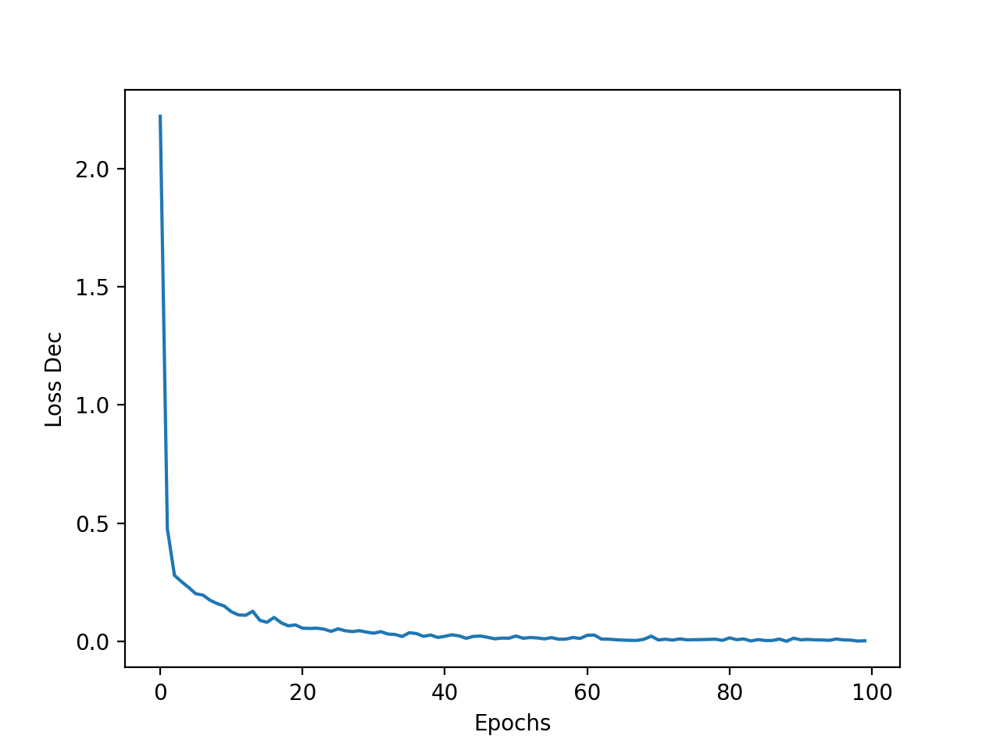

# Results of training on CRACK500 dataset

[Članek](https://ieeexplore.ieee.org/stamp/stamp.jsp?tp=&arnumber=9680172)

[Pregled vseh člankov](https://docs.google.com/spreadsheets/d/1AUmJ-JQtpvQt3Rs0maRirAxbBW6zBOBaPq1kVDSdvK0/edit?usp=sharing)

[Dataset](https://github.com/fyangneil/pavement-crack-detection)

## Dataset

| Parameter         | Value       |
| -----------       | ----------- |
| Input channels    | 3           |
| Input height      | 360         |
| Input width       | 640         |
| Train samples     | 1896        |
| Test samples      | 1124        |
| Validation samples| 348         |

| Set         | Positives   | Negatives   |
| ----------- | ----------- | ----------- |
| Train       | 1896        | 0           |
| Test        | 1124        | 0           |
| Validation  | 348         | 0           |

## Run parameters

Za vse run-e so bili uporabljeni parametri.

| Parameter                      | Value       |
| -----------                    | ----------- |
| Optimizer                      | Adam        |
| Learning rate                  | 0.001       |
| Delta CLS Loss                 | 0.01        |
| Epochs                         | 100         |
| Batch size                     | 10          |
| Dilate                         | 1           |
| Weighted segmentation loss     | False       |
| Dynamically balanced loss      | True        |
| Gradien-flow adjustment        | True        |
| Frequency-of-use sampling      | False       |
| Validate                       | True        |
| Validate on test               | False       |
| Validataton N epochs           | 2           |
| Use best model                 | True        |
| Best model type                | seg         |
| Augmentation                   | True        |

### Decision

| Run         | Precision | Recall   | F1       | Accuracy | TP   | FP   | FN   | TN   | Hard negative mining |
| ------------| ----------| ---------| ---------|----------|------|------|------|------|----------------------|
| run9_1      | 1.0       | 0.994662 | 0.997324 | 0.994662 | 1118 | 0    | 6    | 0    | False                |
| run9_1_nm   | 1.0       | 0.999110 | 0.999555 | 0.999110 | 1123 | 0    | 1    | 0    | True                 |
| run9_2      | 1.0       | 0.999110 | 0.999555 | 0.999110 | 1123 | 0    | 1    | 0    | False                |
| run9_2_nm   | 1.0       | 0.998221 | 0.999110 | 0.998221 | 1122 | 0    | 2    | 0    | True                 |
| run9_3      | 1.0       | 0.999110 | 0.999555 | 0.999110 | 1123 | 0    | 1    | 0    | False                |

### Segmentation 2 pixel distance

| Run         | Precision     | Recall       | F1           | Threshold | Train Negatives |
| ------------| --------------| -------------| -------------|-----------|-----------------|
| run9_1      | 0.748412      | 0.817055     | 0.762888     | 0.46      | 757             |
| run9_1_nm   | 0.729318      | 0.812556     | 0.748788     | 0.29      | 757             |
| run9_2      | 0.756503      | 0.801455     | 0.761883     | 0.285     | 1682            |
| run9_2_nm   | 0.725003      | 0.776382     | 0.730651     | 0.255     | 1682            |
| run9_3      | 0.736470      | 0.806790     | 0.747538     | 0.295     | 1514            |

## Losses

### Loss

| run9_1                     |  run9_2                    | run9_3                     |
| ---------------------------| -------------------------- | -------------------------- |
|  |  |  |

### Decision Loss

| run9_1                             |  run9_2                            | run9_3                             |
| -----------------------------------| ---------------------------------- | ---------------------------------- |
|  |  |  |

### Segmentation Loss

| run9_1                             |  run9_2                            | run9_3                             |
| -----------------------------------| ---------------------------------- | ---------------------------------- |
|  |  |  |

### Val Loss

| run9_1                             |  run9_2                            | run9_3                             |
| -----------------------------------| ---------------------------------- | ---------------------------------- |
|  |  |  |

### Scores

| run9_1                         |  run9_2                        | run9_3                         |
| -------------------------------| ------------------------------ | ------------------------------ |
|  |  |  |

### Outputs

[run9_1](./run9_1/crack500_run9_1.out)

[run9_1_nm](./run9_1/crack500_run9_1_nm.out)

[run9_2](./run9_2/crack500_run9_2.out)

[run9_2_nm](./run9_2/crack500_run9_2_nm.out)

[run9_3](./run9_3/crack500_run9_3.out)