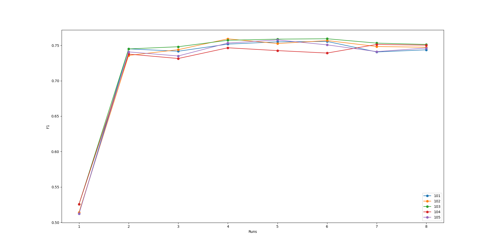

# Results of training on CRACK500 dataset

[Članek](https://ieeexplore.ieee.org/stamp/stamp.jsp?tp=&arnumber=9680172)

[Pregled vseh člankov](https://docs.google.com/spreadsheets/d/1AUmJ-JQtpvQt3Rs0maRirAxbBW6zBOBaPq1kVDSdvK0/edit?usp=sharing)

[Dataset](https://github.com/fyangneil/pavement-crack-detection)

### 1

| Vrsta                | Seed | Precision | Recall   | F1       | TP   | FP   | FN   | TN   |
| ---------------------| -----| ----------| ---------|----------|------|------|------|------|
| Baseline arhitektura | 101  | 0.486262  | 0.654428 | 0.512197 | 1124 | 0    | 0    | 0    |
| Baseline arhitektura | 102  | 0.498529  | 0.647927 | 0.514284 | 1122 | 0    | 2    | 0    |
| Baseline arhitektura | 103  | 0.509030  | 0.660297 | 0.525565 | 1121 | 0    | 3    | 0    |
| Baseline arhitektura | 104  | 0.507850  | 0.675373 | 0.525646 | 1124 | 0    | 0    | 0    |
| Baseline arhitektura | 105  | 0.494937  | 0.640649 | 0.512375 | 1124 | 0    | 0    | 0    |

### 2

| Vrsta                    | Seed  | Precision | Recall   | F1       |
| -------------------------| ------| ----------| ---------|----------|
| U-net brez klasifikacije | 101   | 0.731009  | 0.808847 | 0.745036 |
| U-net brez klasifikacije | 102   | 0.721785  | 0.807461 | 0.735761 |
| U-net brez klasifikacije | 103   | 0.734547  | 0.800624 | 0.744958 |
| U-net brez klasifikacije | 104   | 0.736951  | 0.786890 | 0.737642 |
| U-net brez klasifikacije | 105   | 0.749422  | 0.774335 | 0.740753 |

### 3

| Vrsta                                     | Seed | Precision | Recall   | F1       | TP   | FP   | FN   | TN   |
| ------------------------------------------| -----| ----------| ---------|----------|------|------|------|------|
| Baseline arhitektura + upsampling         | 101  | 0.738081  | 0.791008 | 0.741700 | 0    | 0    | 1124 | 0    |
| Baseline arhitektura + upsampling         | 102  | 0.731677  | 0.798433 | 0.743884 | 0    | 0    | 1124 | 0    |
| Baseline arhitektura + upsampling         | 103  | 0.741123  | 0.792890 | 0.748042 | 1124 | 0    | 0    | 0    |
| Baseline arhitektura + upsampling + bce_w | 103  | 0.734554  | 0.809111 | 0.750412 | 1124 | 0    | 0    | 0    |
| Baseline arhitektura + upsampling         | 104  | 0.715996  | 0.803378 | 0.731436 | 0    | 0    | 1124 | 0    |
| Baseline arhitektura + upsampling + bce_w | 104  | 0.748207  | 0.793619 | 0.749610 | 1124 | 0    | 0    | 0    |
| Baseline arhitektura + upsampling         | 105  | 0.714322  | 0.811605 | 0.735004 | 1124 | 0    | 0    | 0    |
| Baseline arhitektura + upsampling + bce_w | 105  | 0.748435  | 0.786258 | 0.746841 | 1123 | 0    | 1    | 0    |

### 4

| Vrsta                                     | Seed | Negativni | Precision | Recall   | F1       | TP   | FP   | FN   | TN   |
| ------------------------------------------| -----| ----------| ----------| ---------|----------|------|------|------|------|
| Augmentacija + negativni primeri          | 101  | 572       | 0.742209  | 0.803828 | 0.751737 | 1123 | 0    | 1    | 0    |
| Augmentacija + negativni primeri          | 102  | 572       | 0.764785  | 0.791479 | 0.759207 | 1119 | 0    | 5    | 0    |
| Augmentacija + negativni primeri          | 103  | 572       | 0.753666  | 0.806727 | 0.757174 | 1118 | 0    | 6    | 0    |
| Augmentacija + negativni primeri          | 104  | 572       | 0.746313  | 0.797371 | 0.746565 | 1124 | 0    | 0    | 0    |
| Augmentacija + negativni primeri          | 105  | 572       | 0.751214  | 0.795359 | 0.753275 | 1120 | 0    | 4    | 0    |
| Augmentacija + negativni primeri          | 105  | 759       | 0.749918  | 0.800570 | 0.754876 | 1121 | 0    | 3    | 0    |
| Augmentacija + negativni primeri          | 105  | 759       | 0.753656  | 0.799729 | 0.755622 | 1116 | 0    | 8    | 0    |
| Augmentacija + negativni primeri + bce_w  | 105  | 572       | 0.743948  | 0.801724 | 0.747799 | 1124 | 0    | 0    | 0    |

### 5

| Vrsta                                       | Seed      | Negativni | Precision | Recall   | F1       | TP   | FP   | FN   | TN   |
| --------------------------------------------| ----------| ----------| ----------| ---------|----------|------|------|------|------|
| Augmentacija + negativni primeri + črnenje  | 101       | 572       | 0.740519  | 0.807925 | 0.754972 | 1118 | 0    | 6    | 0    |
| Augmentacija + negativni primeri + črnenje  | 102       | 572       | 0.757092  | 0.789197 | 0.752558 | 1124 | 0    | 0    | 0    |
| Augmentacija + negativni primeri + črnenje  | 103       | 572       | 0.756237  | 0.800704 | 0.758777 | 1123 | 0    | 1    | 0    |
| Augmentacija + negativni primeri + črnenje  | 104       | 572       | 0.742239  | 0.793500 | 0.742580 | 1121 | 0    | 3    | 0    |
| Augmentacija + negativni primeri + črnenje  | 105       | 572       | 0.755875  | 0.800198 | 0.757672 | 1124 | 0    | 0    | 0    |

### 6

| Vrsta                                         | Seed | Negativni | Thr adjustment | Precision | Recall   | F1       | TP   | FP   | FN   | TN   |
| ----------------------------------------------| -----| ----------| ---------------| ----------| ---------|----------|------|------|------|------|
| Augmentacija + negativni primeri + thresholds | 101  | 572       | 0.9            | 0.745089  | 0.807269 | 0.755520 | 1123 | 0    | 1    | 0    |
| Augmentacija + negativni primeri + thresholds | 102  | 572       | 0.9            | 0.756101  | 0.797340 | 0.756788 | 1121 | 0    | 3    | 0    |
| Augmentacija + negativni primeri + thresholds | 103  | 572       | 0.9            | 0.746851  | 0.810843 | 0.759321 | 1124 | 0    | 0    | 0    |
| Augmentacija + negativni primeri + thresholds | 104  | 572       | 0.9            | 0.740026  | 0.790492 | 0.739139 | 1123 | 0    | 1    | 0    |
| Augmentacija + negativni primeri + thresholds | 105  | 572       | 0.9            | 0.727181  | 0.823630 | 0.750677 | 1121 | 0    | 3    | 0    |

### 7

| Vrsta                                          | Seed      | Negativni | Precision | Recall   | F1       | TP   | FP   | FN   | TN   |
| -----------------------------------------------| ----------| ----------| ----------| ---------|----------|------|------|------|------|
| Augmentacija + negativni primeri + neg mining  | 101       | 572       | 0.734208  | 0.794404 | 0.740687 | 1116 | 0    | 8    | 0    |
| Augmentacija + negativni primeri + neg mining  | 102       | 572       | 0.731809  | 0.809744 | 0.748363 | 1120 | 0    | 4    | 0    |
| Augmentacija + negativni primeri + neg mining  | 103       | 572       | 0.739416  | 0.810507 | 0.753165 | 1122 | 0    | 2    | 0    |
| Augmentacija + negativni primeri + neg mining  | 104       | 572       | 0.740360  | 0.805876 | 0.751304 | 1123 | 0    | 1    | 0    |
| Augmentacija + negativni primeri + neg mining  | 105       | 572       | 0.738865  | 0.790862 | 0.741181 | 1120 | 0    | 4    | 0    |

### 8

| Vrsta                                                    | Seed | Negativni | Precision | Recall   | F1       | TP   | FP   | FN   | TN   |
| ---------------------------------------------------------| -----| ----------| ----------| ---------|----------|------|------|------|------|
| Augmentacija + negativni primeri + črnenje + neg mining  | 101  | 572       | 0.730899  | 0.799624 | 0.743699 | 1123 | 0    | 1    | 0    |
| Augmentacija + negativni primeri + črnenje + neg mining  | 102  | 572       | 0.744423  | 0.787611 | 0.747328 | 1120 | 0    | 4    | 0    |
| Augmentacija + negativni primeri + črnenje + neg mining  | 103  | 572       | 0.754397  | 0.786419 | 0.751260 | 1121 | 0    | 3    | 0    |
| Augmentacija + negativni primeri + črnenje + neg mining  | 104  | 572       | 0.750366  | 0.792788 | 0.750243 | 1121 | 0    | 3    | 0    |
| Augmentacija + negativni primeri + črnenje + neg mining  | 105  | 572       | 0.731879  | 0.805741 | 0.746229 | 1122 | 0    | 2    | 0    |

 