# Results of training on CRACK500 dataset

## Model architecture

## Dataset

| Parameter         | Value       |
| -----------       | ----------- |
| Input channels    | 3           |
| Input height      | 640         |
| Input width       | 360         |
| Train samples     | 1896        |
| Test samples      | 1124        |
| Validation samples| 348         |

| Set         | Positives   | Negatives   |  Sum        |
| ----------- | ----------- | ----------- | ----------- |
| Train       | 1896        | 0           | 1896        |
| Test        | 1124        | 0           | 1124        |
| Validation  | 348         | 0           | 348         |
| **Sum**     | 3368        | 0           | 3368        |

## Run parameters

| Parameter                      | Value       |
| -----------                    | ----------- |
| Batch size                     | 1           |
| Epochs                         | 50          |
| Learning rate                  | 1.0         |
| Delta CLS Loss                 | 0.01        |
| Dilate                         | 1           |
| Dynamically balanced loss      | True        |
| Gradien-flow adjustment        | True        |
| Frequency-of-use sampling      | False       |
| Weighted segmentation loss     | False       |
| Use best model                 | True        |
| Best model type                | seg         |
| Validate                       | True        |
| Validate on test               | False       |

## Test Evaluation

### Decision
| Precision | Recall   | F1       | Accuracy | Threshold | TP   | FP   | FN   | TN   |
| ----------| ---------| ---------|----------|-----------|------|------|------|------|
| 1         | 0.997331 | 0.998664 | 0.997331 | 0.999685  | 1121 | 0    | 3    | 0    |

### Segmentation
| Dice mean | Dice std | IoU mean | IoU std  | Threshold |
| ----------| ---------| ---------|----------|-----------|
| 0.68227   | 0.15953  | 0.53757  | 0.16587  | 0.42      |

### 2 pixel distance
| Precision | Recall   | F1       | Threshold |
| ----------| ---------| ---------|-----------|
| 0.728432  | 0.793387 | 0.740356 | 0.4       |

### Primerjava - 2 pixel distance

| **Methods**  | Precision  | Recall     | F1         |
| -------------| -----------| -----------| -----------|
| Jenkins      | 0.6811     | 0.6629     | 0.6788     |
| Zhang        | 0.7368     | 0.7165     | 0.7295     |
| Lau          | 0.7426     | 0.7285     | 0.7327     |
| Li (Članek)  | **0.7909** | 0.7650     | **0.7778** |
| **Moj**      | 0.7284     | **0.7934** | 0.7404     |

[Članek](https://ieeexplore.ieee.org/stamp/stamp.jsp?tp=&arnumber=9680172)

## Losses

### Loss Segmentation
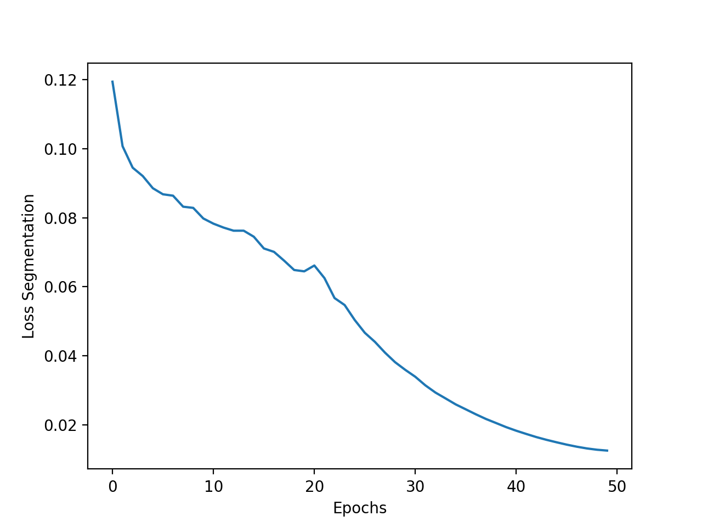

### Loss Decision
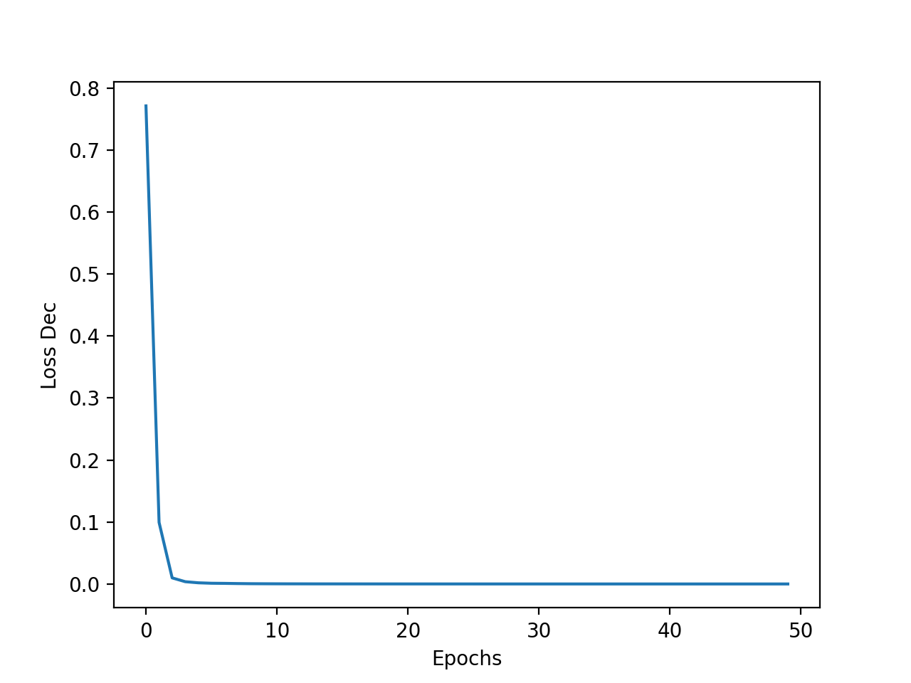

### Total Loss
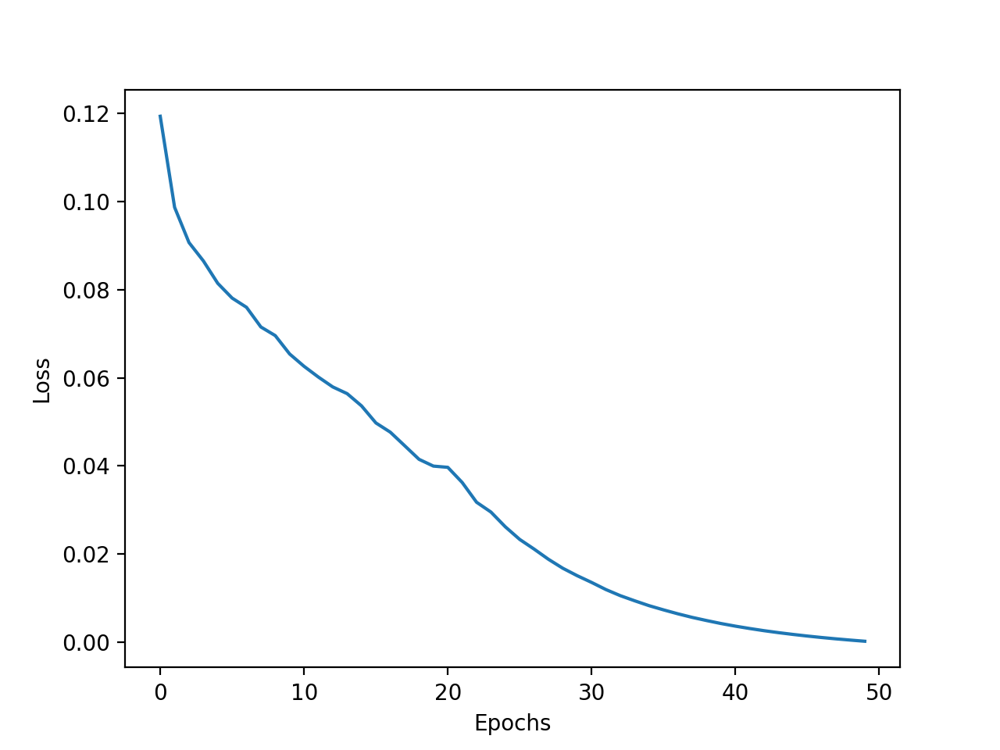

### Validation
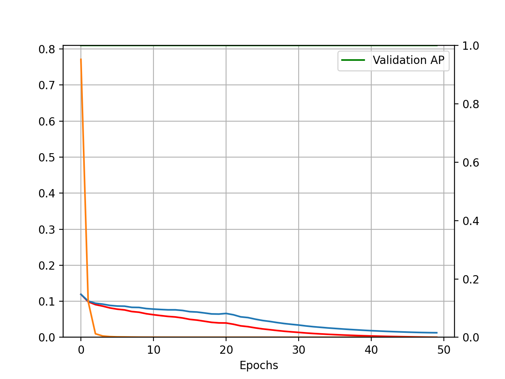

### Pr, Re, F1
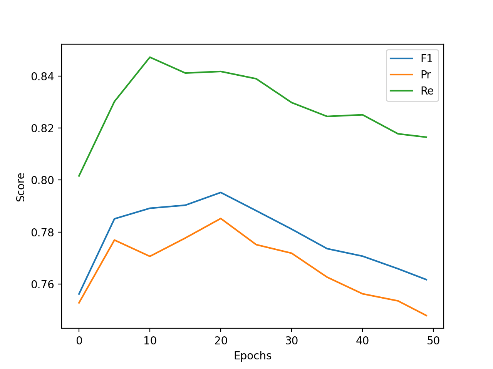

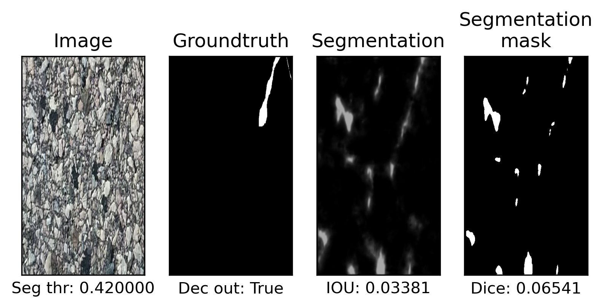
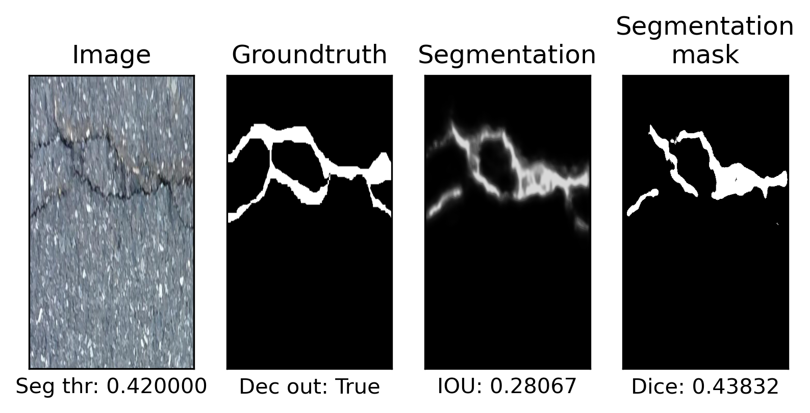
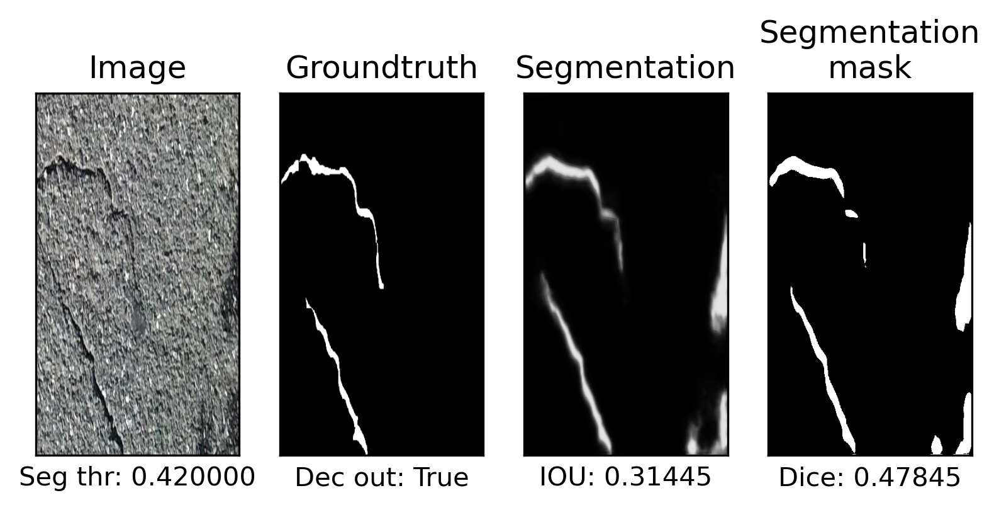
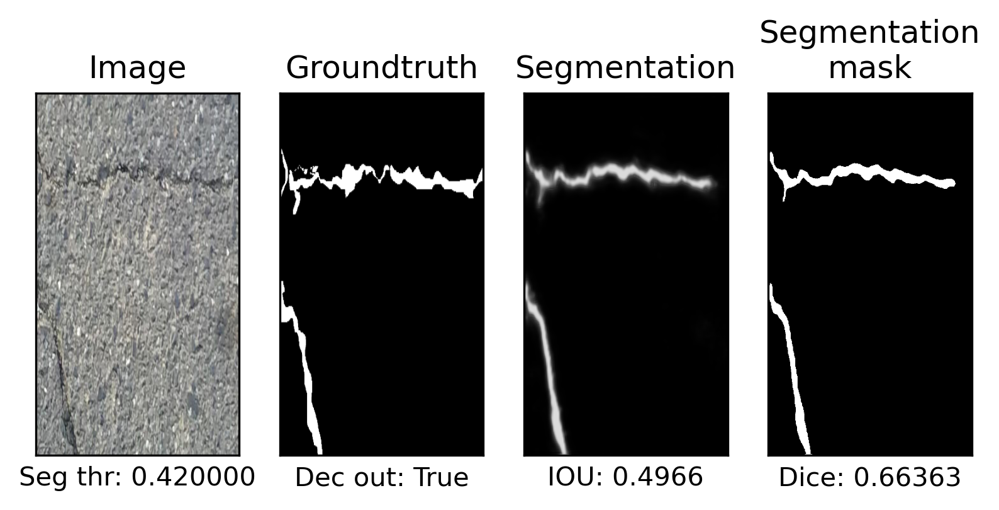
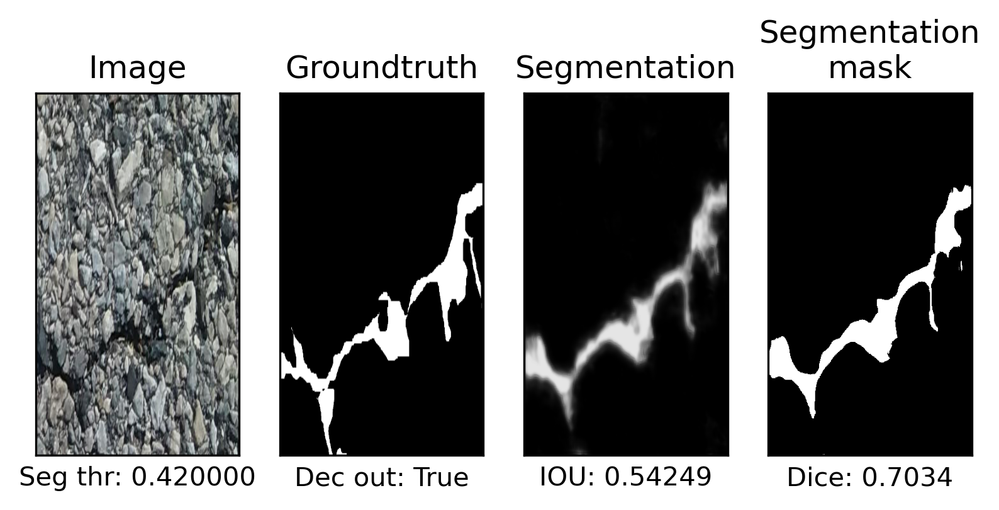
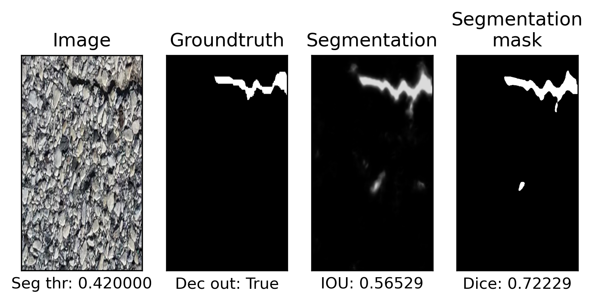
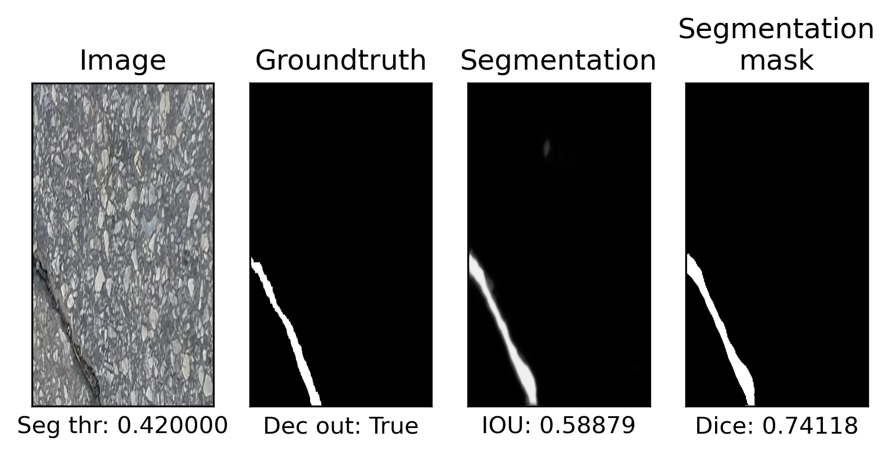
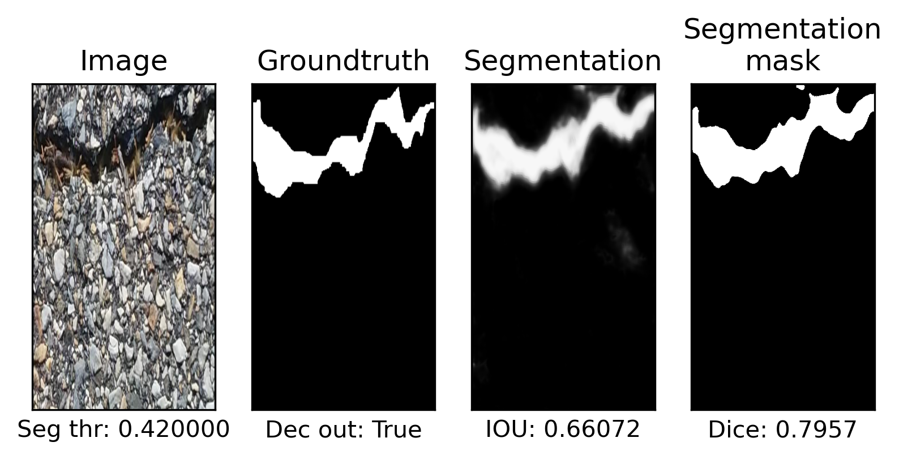
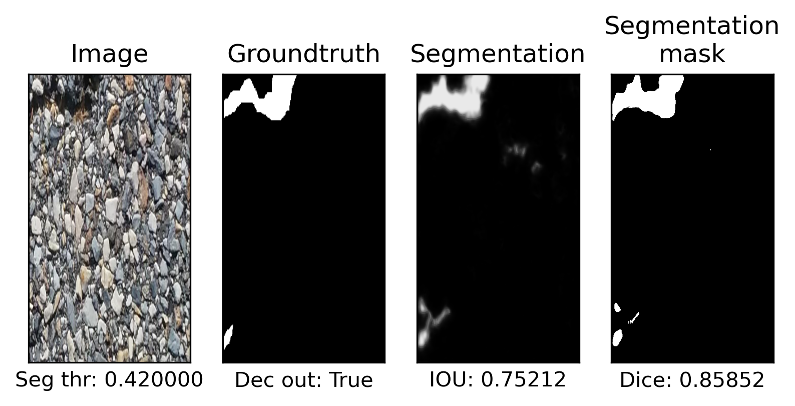
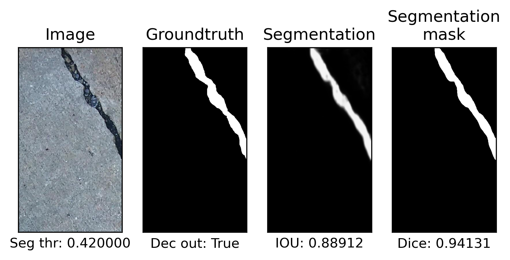

Output of model learning is [here](./crack500_run1.out).