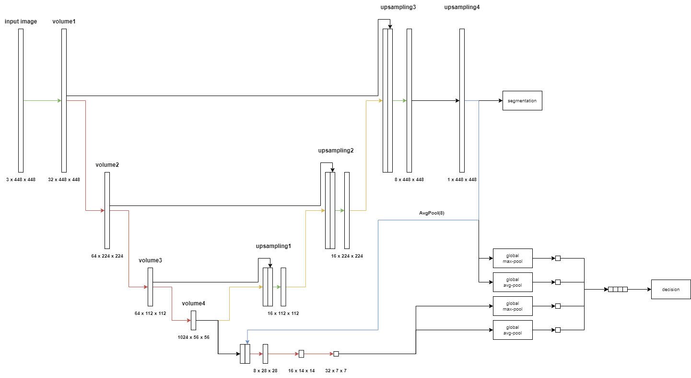

# Results of evaluations

## Model architecture used

## Dataset

| Parameter         | Value       |
| -----------       | ----------- |
| Input channels    | 3           |
| Input height      | 448         |
| Input width       | 448         |
| Train samples     | 7908        |
| Test samples      | 1695        |
| Validation samples| 1695        |
| Segmented samples | 6921        |

| Set         | Positives   | Negatives   |  Sum        |
| ----------- | ----------- | ----------- | ----------- |
| Train       | 6921        | 987         | 7908        |
| Test        | 1483        | 212         | 1695        |
| Validation  | 1483        | 212         | 1695        |
| **Sum**     | 9887        | 1411        | 11298       |

## Run parameters

| Parameter                      | Value       |
| -----------                    | ----------- |
| Batch size                     | 1           |
| Epochs                         | 50          |
| Learning rate                  | 1           |
| Delta CLS Loss                 | 0.01        |
| Dilate                         | 1           |
| Dynamically balanced loss      | True        |
| Frequency-of-use sampling      | True        |
| Gradien-flow adjustment        | True        |
| Weighted segmentation loss     | False       |
| Use best model                 | True        |
| Best model type                | both        |
| Validate                       | True        |
| Validate on test               | False       |

## Evaluations

**Run 1:**
- Optimalen threshold za F1 na vseh pikslih primerov

**Run 2:**
- Optimalen threshold za Dice - računan s korakom 0.005

**Run 3:**
- Optimalen threshold za Dice - računan s korakom 0.005
- Črnenje segmentacij primerov, ki so klasificirani kot brez razpoke

**Run 4:**
- Optimalen threshold za Dice - računan s korakom 0.005
- Črnenje segmentacij primerov, ki so klasificirani kot brez razpoke
- Beljenje segmentacij, ki so črne ampak klasificirane kot razpoka - Threshold = faktor * max_pixel_segmentacije
    - Validacija: Računanje optimalnega zmanjševalnega faktorja za vsak tak primer - Vzamemo povprečje 

## Evaluation Results

### Decision
|             | Precision | Recall   | F1       | Accuracy | Threshold | TP   | FP   | FN   | TN   |
| ----------- | ----------| ---------| ---------|----------|-----------|------|------|------|------|
| **Run 1**   | 0.996596  | 0.987188 | 0.991870 | 0.985841 | 0.868691  | 1464 | 5    | 19   | 207  |
| **Run 2**   | 0.996596  | 0.987188 | 0.991870 | 0.985841 | 0.868691  | 1464 | 5    | 19   | 207  |
| **Run 3**   | 0.996596  | 0.987188 | 0.991870 | 0.985841 | 0.868691  | 1464 | 5    | 19   | 207  |
| **Run 4**   | 0.996596  | 0.987188 | 0.991870 | 0.985841 | 0.868691  | 1464 | 5    | 19   | 207  |

### Segmentation
|              | Dice mean | Dice std | IoU mean | IoU std  | Threshold |
| -------------| ----------| ---------| ---------|----------|-----------|
| **Run 1**    | 0.68974   | 0.20328  | 0.56122  | 0.23060  | 0.13716   |
| **Run 2**    | 0.70520   | 0.19922  | 0.57841  | 0.22581  | 0.385     |
| **Run 3**    | 0.70861   | 0.19640  | 0.58203  | 0.22516  | 0.35      |
| **Run 4**    | 0.70798   | 0.19599  | 0.58116  | 0.22488  | 0.35      |

## Primerjave

### Primerjava dice score-a pri pocrnjenih segmentacijah
[Primerjava2_3](./primerjava2_3.md)

### Primerjava dice score-a pri pobeljenih segmentacijah
[Primerjava3_4](./primerjava3_4.md)

## Outputs
[Run 1](./run1.out)
[Run 2](./run2.out)
[Run 3](./run3.out)