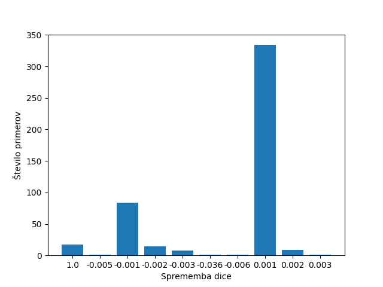

# Results of evaluations

## Model architecture used

## Dataset

| Parameter         | Value       |
| -----------       | ----------- |
| Input channels    | 3           |
| Input height      | 448         |
| Input width       | 448         |
| Train samples     | 7908        |
| Test samples      | 1695        |
| Validation samples| 1695        |
| Segmented samples | 6921        |

| Set         | Positives   | Negatives   |  Sum        |
| ----------- | ----------- | ----------- | ----------- |
| Train       | 6921        | 987         | 7908        |
| Test        | 1483        | 212         | 1695        |
| Validation  | 1483        | 212         | 1695        |
| **Sum**     | 9887        | 1411        | 11298       |

## Run parameters

| Parameter                      | Value       |
| -----------                    | ----------- |
| Batch size                     | 1           |
| Epochs                         | 50          |
| Learning rate                  | 1           |
| Delta CLS Loss                 | 0.01        |
| Dilate                         | 1           |
| Dynamically balanced loss      | True        |
| Frequency-of-use sampling      | True        |
| Gradien-flow adjustment        | True        |
| Weighted segmentation loss     | False       |
| Use best model                 | True        |
| Validate                       | True        |
| Validate on test               | False       |
| Dice threshold                 | 2           |
| Dice threshold factor          | 1           |

## Test Evaluation

Original: EVAL on TEST AUC=0.998385, and AP=0.999756, w/ best thr=0.194860 at f-m=0.996 and FP=5, FN=7

## Evaluations

**Run 1:**
- Vzamem najboljši model
- Na validacijski množici:
    - Izračunam najboljši threshold (threshold step=0.01) za F1 z 2 pixel razdaljo na vseh segmentacijah
    - Izračunam najboljši segmentacijski threshold Precision-Recall na vseh pixlih
    - Izračunam najboljši klasifikacijski threshold Precision-Recall na vseh predikcijah
- Na testni množici:
    - Izračunam Pr, Re, F1 na nivoju slik s klasifikacijskim thresholdom
    - Vsem klasificiranim primerom brez razpok počrnim segmentacijo
    - Izračunam Dice in IoU s segmentacijskim thresholdom
    - Izračunam Pr, Re, F1 na nivoju pixlov z 2 pixel razdaljo

## Evaluation Results

### Decision
|             | Precision | Recall   | F1       | Accuracy | Threshold |
| ----------- | ----------| ---------| ---------|----------|-----------|
| **Run 1**   | 0.996596  | 0.993216 | 0.994903 | 0.991150 | 0.532289  |
| **Run 2**   | 0  | 0 | 0 | 0 | 0  |

### Segmentation
|              | Dice mean | Dice std | IoU mean | IoU std  | Threshold |
| -------------| ----------| ---------| ---------|----------|-----------|
| **Original** | 0.6796    | 0.2121   | 0.55106  | 0.23302  | 0.13617   |
| **Run 1**    | 0.68974   | 0.20328  | 0.56122  | 0.2306   | 0.13716   |
| **Run 2**    | 0  | 0 | 0 | 0 | 0  |

### 2 pixel distance

|             | Precision | Recall   | F1       | Threshold |
| ----------- | ----------| ---------| ---------|-----------|
| **Run 1**   | 0  | 0 | 0 | 0.19  |
| **Run 2**   | 0  | 0 | 0 | 0 | 0  |

## Primerjava Dice

Primerjava **Run 1** in **Original** run-a.

#### Spremembe

|Spremenjenih|Nespremenjenih|
|-----------:|-------------:|
|         470|          1225|

#### Spremembe

|Pozitivno|Negativno|
|--------:|--------:|
|      361|      109|

|1.0|-0.005|-0.001|-0.002|-0.003|-0.036|-0.006|0.001|0.002|0.003|
|--:|-----:|-----:|-----:|-----:|-----:|-----:|----:|----:|----:|
| 17|     1|    84|    14|     8|     1|     1|  334|    9|    1|

## Outputs
[Run 1](./upsampling_7/nohup.out)