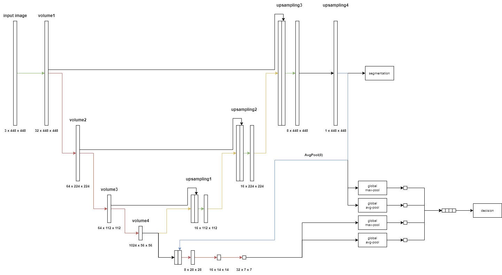

# Results of evaluations

## Model architecture used

## Dataset

| Parameter         | Value       |
| -----------       | ----------- |
| Input channels    | 3           |
| Input height      | 448         |
| Input width       | 448         |
| Train samples     | 7908        |
| Test samples      | 1695        |
| Validation samples| 1695        |
| Segmented samples | 6921        |

| Set         | Positives   | Negatives   |  Sum        |
| ----------- | ----------- | ----------- | ----------- |
| Train       | 6921        | 987         | 7908        |
| Test        | 1483        | 212         | 1695        |
| Validation  | 1483        | 212         | 1695        |
| **Sum**     | 9887        | 1411        | 11298       |

## Run parameters

| Parameter                      | Value       |
| -----------                    | ----------- |
| Batch size                     | 1           |
| Epochs                         | 50          |
| Learning rate                  | 1           |
| Delta CLS Loss                 | 0.01        |
| Dilate                         | 1           |
| Dynamically balanced loss      | True        |
| Frequency-of-use sampling      | True        |
| Gradien-flow adjustment        | True        |
| Weighted segmentation loss     | False       |
| Use best model                 | True        |
| Validate                       | True        |
| Validate on test               | False       |
| Dice threshold                 | 2           |
| Dice threshold factor          | 1           |

## Test Evaluation

Original: EVAL on TEST AUC=0.998385, and AP=0.999756, w/ best thr=0.194860 at f-m=0.996 and FP=5, FN=7

## Evaluations

**Run 1:**
- Vzamem najboljši model
- Na validacijski množici:
    - Izračunam najboljši threshold (threshold step=0.01) za F1 z 2 pixel razdaljo na vseh segmentacijah
    - Izračunam najboljši segmentacijski threshold Precision-Recall na vseh pixlih
    - Izračunam najboljši klasifikacijski threshold Precision-Recall na vseh predikcijah
- Na testni množici:
    - Izračunam Pr, Re, F1 na nivoju slik s klasifikacijskim thresholdom
    - Vsem klasificiranim primerom brez razpok počrnim segmentacijo
    - Izračunam Dice in IoU s segmentacijskim thresholdom
    - Izračunam Pr, Re, F1 na nivoju pixlov z 2 pixel razdaljo

**Run 2:**
- Vzamem najboljši model
- Na validacijski množici:
    - Izračunam najboljši klasifikacijski threshold Precision-Recall na vseh predikcijah
    - Počrnim vse segmentacije, kjer model določi da ni razpoke
    - Izračunam najboljši threshold (threshold step=0.01) za F1 z 2 pixel razdaljo na vseh segmentacijah
    - Izračunam najboljši segmentacijski threshold Precision-Recall na pixlih vseh primerov, ki jih je model klasificiral kot razpoko
    - Segmentacijski threshold zmanjsujem in zvisujem, racunam Dice in določim nov segmentacijski threshold z najboljšim Dice-om
- Na testni množici:
    - Izračunam Pr, Re, F1 na nivoju slik s klasifikacijskim thresholdom
    - Vsem klasificiranim primerom brez razpok počrnim segmentacijo
    - Izračunam Dice in IoU s segmentacijskim thresholdom
    - Izračunam Pr, Re, F1 na nivoju pixlov z 2 pixel razdaljo

**Run 3:**
- Vzamem najboljši model
- Na validacijski množici:
    - Izračunam najboljši klasifikacijski threshold Precision-Recall na vseh predikcijah
    - Počrnim vse segmentacije, kjer model določi da ni razpoke
    - Izračunam najboljši threshold (threshold step=0.01) za F1 z 2 pixel razdaljo na vseh segmentacijah
    - Za vsak threshold od 0.01 do 0.99 s korakom 0.005 izračunam Dice - izberem threshold z najvišjim dice-om
- Na testni množici:
    - Izračunam Pr, Re, F1 na nivoju slik s klasifikacijskim thresholdom
    - Vsem klasificiranim primerom brez razpok počrnim segmentacijo
    - Izračunam Dice in IoU s segmentacijskim thresholdom
    - Izračunam Pr, Re, F1 na nivoju pixlov z 2 pixel razdaljo

## Evaluation Results

### Decision
|             | Precision | Recall   | F1       | Accuracy | Threshold | TP   | FP   | FN   | TN   |
| ----------- | ----------| ---------| ---------|----------|-----------|------|------|------|------|
| **Run 1**   | 0.996596  | 0.993216 | 0.994903 | 0.991150 | 0.532289  | 1464 | 5    | 10   | 216  |
| **Run 2**   | 0.996596  | 0.993216 | 0.994903 | 0.991150 | 0.532289  | 1464 | 5    | 10   | 216  |
| **Run 3**   | 0.996596  | 0.993216 | 0.994903 | 0.991150 | 0.532289  | 1464 | 5    | 10   | 216  |

### Segmentation
|              | Dice mean | Dice std | IoU mean | IoU std  | Threshold |
| -------------| ----------| ---------| ---------|----------|-----------|
| **Original** | 0.67960   | 0.21210  | 0.55106  | 0.23302  | 0.13617   |
| **Run 1**    | 0.68974   | 0.20328  | 0.56122  | 0.23060  | 0.13716   |
| **Run 2**    | 0.69575   | 0.20477  | 0.56862  | 0.23033  | 0.20437   |
| **Run 3**    | 0.69792   | 0.20780  | 0.57191  | 0.23151  | 0.29000   |

### 2 pixel distance

|             | Precision | Recall   | F1       | Threshold |
| ----------- | ----------| ---------| ---------|-----------|
| **Run 1**   | 0.697039  | 0.737209 | 0.699708 | 0.19      |
| **Run 2**   | 0.697039  | 0.737209 | 0.699708 | 0.19      |
| **Run 3**   | 0.697039  | 0.737209 | 0.699708 | 0.19      |

## Primerjava Dice

Primerjava **Run 3** in **Original** run-a.

|Spremenjenih|Nespremenjenih|
|-----------:|-------------:|
|        1460|           235|

|Pozitivno|Negativno|        
|--------:|--------:|
|     1020|      440|

Za 1.0 se je spremenilo 17 primerov.

## Outputs
[Run 1](./upsampling_7/run1.out)
[Run 2](./upsampling_7/run2.out)
[Run 3](./upsampling_7/run3.out)