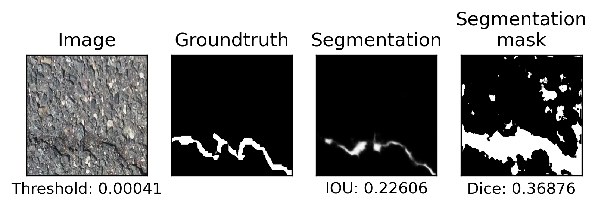

# Results of training on crack_segmentation dataset

## Dataset

| Parameter         | Value       |
| -----------       | ----------- |
| Input channels    | 3           |
| Input height      | 640         |
| Input width       | 232         |
| Input width       | 232         |
| Train samples     | 7908        |
| Test samples      | 1695        |
| Validation samples| 1695        |
| Segmented samples | 6921        |

| Set         | Positives   | Negatives   |  Sum        |
| ----------- | ----------- | ----------- | ----------- |
| Train       | 6921        | 987         | 7908        |
| Test        | 1483        | 212         | 1695        |
| Validation  | 1483        | 212         | 1695        |
| **Sum**     | 9887        | 1411        | 11298       |

## Run parameters
| Parameter                      | Value       |
| -----------                    | ----------- |
| Batch size                     | 1           |
| Epochs                         | 50          |
| Learning rate                  | 1           |
| Delta CLS Loss                 | 0.01        |
| Dilate                         | 1           |
| Dynamically balanced loss      | True        |
| Frequency-of-use sampling      | True        |
| Gradien-flow adjustment        | True        |
| Weighted segmentation loss     | True        |
| Weighted segmentation loss Max | 1.0         |
| Weighted segmentation loss P   | 2.0         |
| Use best model                 | True        |
| Validate                       | True        |
| Validate on test               | False       |

## Runs
### Run 1 : Minimum of max pixels in all predicted segmentations.
| Parameter                      | Value       |
| -----------                    | ----------- |
| DICE_THRESHOLD                 | 1           |
### Run 2 : Best threshold of precision_recall_curve for every 10th pixel.
| Parameter                      | Value       |
| -----------                    | ----------- |
| DICE_THRESHOLD                 | 2           |
| DICE_THR_FACTOR                | 10          |

## Test Evaluation

Run 1: EVAL on TEST AUC=0.998315, and AP=0.999745, w/ best thr=0.099568 at f-m=0.993 and FP=14, FN=6
Run 2: EVAL on TEST AUC=0.997937, and AP=0.999680, w/ best thr=0.074480 at f-m=0.993 and FP=17, FN=4

## ROC

Run 1                             |  Run 2
:--------------------------------:|:-------------------------:
  |  

## Precision Recall

Run 1                                         |  Run 2
:--------------------------------------------:|:-------------------------:
  |  

## Losses

### Loss Segmentation

Run 1                                       |  Run 2
:------------------------------------------:|:-------------------------:
  |  

### Loss Decision

Run 1                                       |  Run 2
:------------------------------------------:|:-------------------------:
  |  

### Total Loss

Run 1                                       |  Run 2
:------------------------------------------:|:-------------------------:
          |  

### Validation

Run 1                                       |  Run 2
:------------------------------------------:|:-------------------------:
  |  

### Dice and IoU

Run 1                                       |  Run 2
:------------------------------------------:|:-------------------------:
  |  

## Dices

### Run 1
Threshold = 0.000415 (From validation)
|             | mean        | std         |
| ----------- | ----------- | ----------- |
| **Dice**    | 0.37018     | 0.21866     |
| **Jaccard** | 0.24965     | 0.17007     |

### Run 2
Threshold = 0.007956 (From validation)
|             | mean        | std         |
| ----------- | ----------- | ----------- |
| **Dice**    | 0.59583     | 0.26028     |
| **Jaccard** | 0.46685     | 0.23415     |

Run 1                                       |  Run 2
:------------------------------------------:|:-------------------------:
   |  
  |  
  |  
  |  
  |  
  |  

## Outputs
[Run 1](./upsampling_6_1/nohup.out)

[Run 2](./upsampling_6_2/nohup.out)