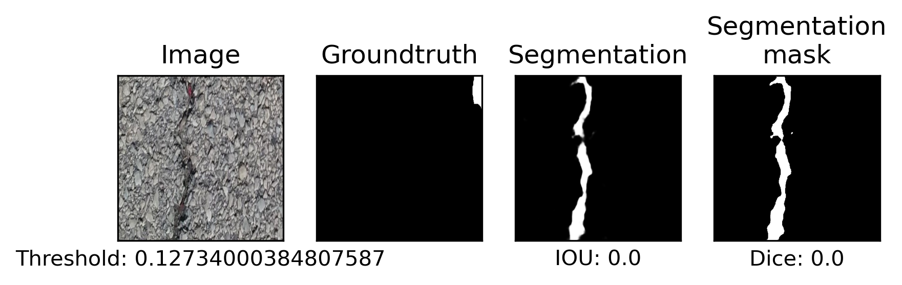

# Results of training on crack_segmentation dataset

## Model architecture

### Original architecture

### New architecture

## Dataset

| Parameter         | Value       |
| -----------       | ----------- |
| Input channels    | 3           |
| Input height      | 640         |
| Input width       | 232         |
| Input width       | 232         |
| Train samples     | 7908        |
| Test samples      | 1695        |
| Validation samples| 1695        |
| Segmented samples | 6921        |

| Set         | Positives   | Negatives   |  Sum        |
| ----------- | ----------- | ----------- | ----------- |
| Train       | 6921        | 987         | 7908        |
| Test        | 1483        | 212         | 1695        |
| Validation  | 1483        | 212         | 1695        |
| **Sum**     | 9887        | 1411        | 11298       |

## Run parameters

| Parameter                      | Value       |
| -----------                    | ----------- |
| Batch size                     | 1           |
| Epochs                         | 50          |
| Learning rate                  | 1           |
| Delta CLS Loss                 | 0.01        |
| Dilate                         | 1           |
| Dynamically balanced loss      | True        |
| Frequency-of-use sampling      | True        |
| Gradien-flow adjustment        | True        |
| Weighted segmentation loss     | False       |
| Use best model                 | True        |
| Validate                       | True        |
| Validate on test               | False       |
| Dice threshold                 | 2           |
| Dice threshold factor          | 1           |

## Test Evaluation

|               | False       | True        |
| -----------   | ----------- | ----------- |
| **Positive**  | 17          | 1477        |
| **Negative**  | 6           | 195         |

## ROC

## Precision Recall

## Losses

### Loss Segmentation

### Loss Decision

### Total Loss

### Validation

### Dice and IoU

## Dices

### Threshold = 0.127340 (From validation)

|             | mean        | std         |
| ----------- | ----------- | ----------- |
| **Dice**    | 0.66863     | 0.22562     |
| **IoU**     | 0.5409      | 0.23516     |

Output of model learning is [here](./nohup.out).