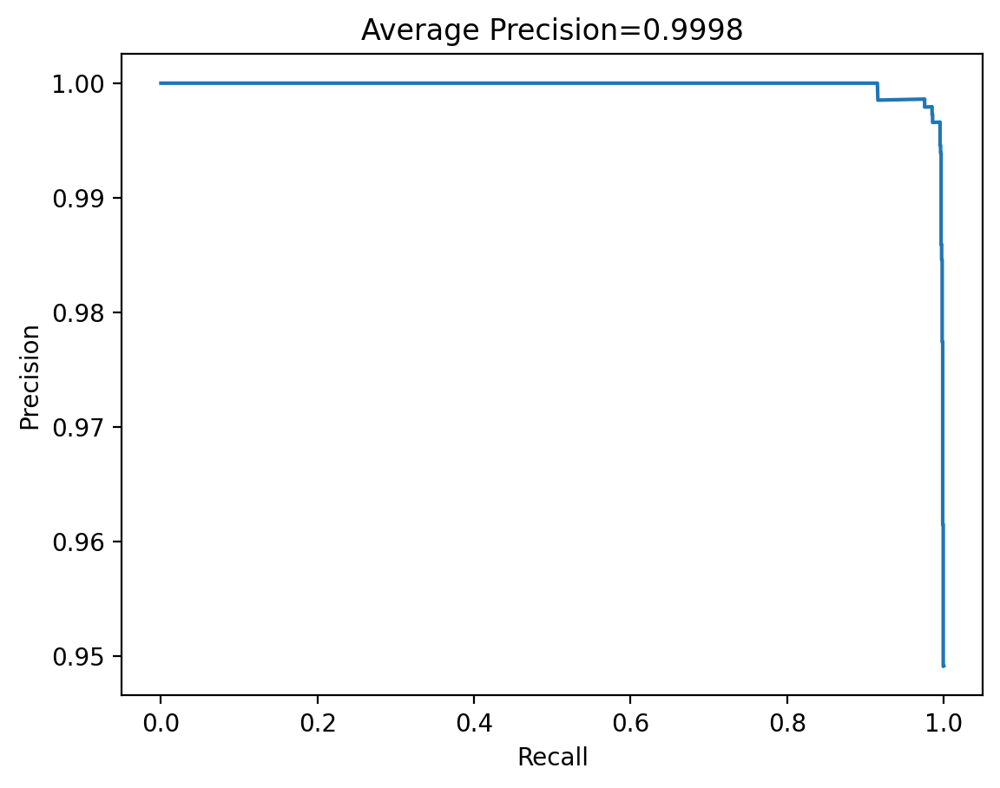
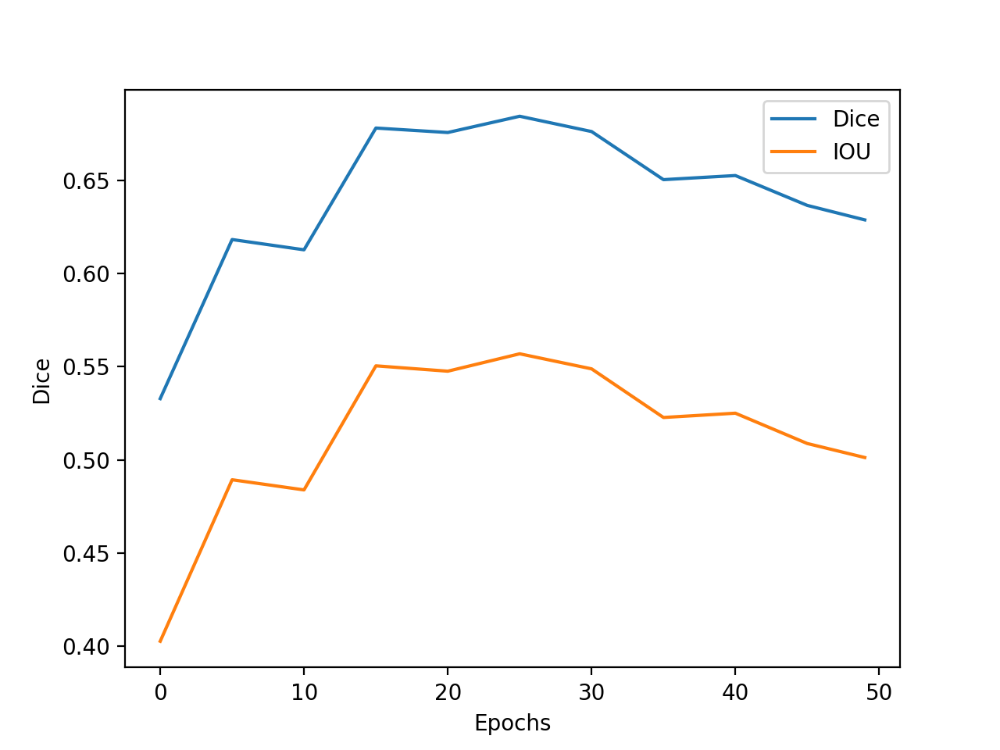
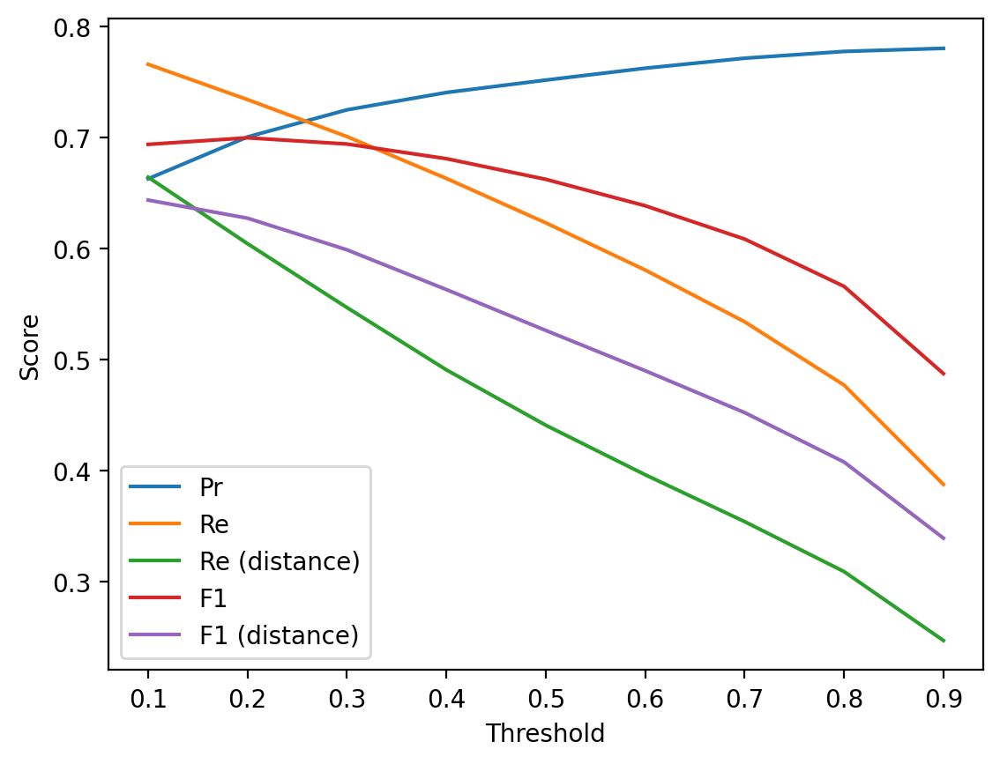

# Results of training on crack_segmentation dataset

## Model architecture

### Run 1

### Run 2

## Dataset

| Parameter         | Value       |
| -----------       | ----------- |
| Input channels    | 3           |
| Input height      | 640         |
| Input width       | 232         |
| Input width       | 232         |
| Train samples     | 7908        |
| Test samples      | 1695        |
| Validation samples| 1695        |
| Segmented samples | 6921        |

| Set         | Positives   | Negatives   |  Sum        |
| ----------- | ----------- | ----------- | ----------- |
| Train       | 6921        | 987         | 7908        |
| Test        | 1483        | 212         | 1695        |
| Validation  | 1483        | 212         | 1695        |
| **Sum**     | 9887        | 1411        | 11298       |

## Run parameters

| Parameter                      | Value       |
| -----------                    | ----------- |
| Batch size                     | 1           |
| Epochs                         | 50          |
| Learning rate                  | 1           |
| Delta CLS Loss                 | 0.01        |
| Dilate                         | 1           |
| Dynamically balanced loss      | True        |
| Frequency-of-use sampling      | True        |
| Gradien-flow adjustment        | True        |
| Weighted segmentation loss     | False       |
| Use best model                 | True        |
| Validate                       | True        |
| Validate on test               | False       |
| Dice threshold                 | 2           |
| Dice threshold factor          | 1           |

## Test Evaluation

Run 1: EVAL on TEST AUC=0.999352, and AP=0.999905, w/ best thr=0.095512 at f-m=0.996 and FP=10, FN=3

Run 2: EVAL on TEST AUC=0.998385, and AP=0.999756, w/ best thr=0.194860 at f-m=0.996 and FP=5, FN=7

## ROC

Run 1                             |  Run 2
:--------------------------------:|:-------------------------:
    |  

## Precision Recall

Run 1                             |  Run 2
:--------------------------------:|:-------------------------:
    |  

## Losses

### Loss Segmentation

Run 1                             |  Run 2
:--------------------------------:|:-------------------------:
    |  

### Loss Decision

Run 1                             |  Run 2
:--------------------------------:|:-------------------------:
    |  

### Total Loss

Run 1                             |  Run 2
:--------------------------------:|:-------------------------:
    |  

### Validation

Run 1                             |  Run 2
:--------------------------------:|:-------------------------:
    |  

### Dice and IoU
Run 1                             |  Run 2
:--------------------------------:|:-------------------------:
    |  

## Dices
### Run 1
Threshold = 0.1273 (From validation)
|             | mean        | std         |
| ----------- | ----------- | ----------- |
| **Dice**    | 0.6686      | 0.2256      |
| **IoU**     | 0.5409      | 0.2352      |

### Run 2
Threshold = 0.1362 (From validation)
|             | mean        | std         |
| ----------- | ----------- | ----------- |
| **Dice**    | 0.6796      | 0.2121      |
| **IoU**     | 0.5511      | 0.233       |

Run 1                             |  Run 2
:--------------------------------:|:-------------------------:
     |  
    |  
     |  
     |  
     |  
     |  

## Evaluation (Run 2)

Računanje Pr, Re, F1, Dice in IoU pri različnih thresholdih.

| Threshold   | Pr          | Re          | F1          | Dice       | IoU        |
| ----------- | ----------- | ----------- | ----------- | ---------- | ---------- |
| 0.1         | 0.473       | **0.8037**  | 0.5955      | 0.5955     | 0.424      |
| 0.2         | 0.5148      | 0.7603      | 0.6139      | 0.6139     | 0.4429     |
| 0.3         | 0.5507      | 0.7219      | 0.6247      | 0.6247     | 0.4543     |
| 0.4         | 0.586       | 0.6833      | 0.6309      | 0.6309     | 0.4609     |
| 0.5         | 0.6198      | 0.6457      | **0.6325**  | **0.6325** | **0.4625** |
| 0.6         | 0.6514      | 0.6076      | 0.6288      | 0.6288     | 0.4585     |
| 0.7         | 0.6802      | 0.5666      | 0.6182      | 0.6182     | 0.4474     |
| 0.8         | 0.7081      | 0.5173      | 0.5979      | 0.5979     | 0.4264     |
| 0.9         | **0.7449**  | 0.4418      | 0.5546      | 0.5546     | 0.3837     |

Računanje Pr, Re in F1.

As in CrackForest, a true positive is defined as any labelled pixel in the output segmentation mask that is within 2 pixels of a true label in the ground truth.

Za računanje na GT maski naredim razširanje (dilate) s cross kernelom 5x5.

TP(distance) = vsi crack predict pixli v 2 pxl oddaljenosti od GT labeliranih pixlov

FP(distance) = labelirano kot non-crack, predicted kot crack (2 pxl distance)

FN = labelirano kot crack, predicted kot non-crack

FN(distance) = labelirano kot crack, predicted kot non-crack (2 pxl distance)

Pr = $\frac{TP(distance)}{TP(distance) + FP(distance)}$

Re = $\frac{TP(distance)}{TP(distance) + FN}$

Re(distance) = $\frac{TP(distance)}{TP(distance) + FN(distance)}$

F1 = $\frac{2 * Pr * Re}{Pr + Re}$

F1(distance) = $\frac{2 * Pr * Re(distance)}{Pr + Re(distance)}$

Primeri:

Original GT                       |  Dilated GT
:--------------------------------:|:------------------------------------------------:
    |  
   |  
    |  

| Threshold   | Pr          | Re          | Re - distance | F1         | F1 - distance |
| ----------- | ----------- | ----------- | -----------   | ---------- | ----------    |
| 0.1         | 0.6628      | **0.7659**  | **0.6642**    | 0.6938     | **0.6436**    |
| 0.2         | 0.7005      | 0.7341      | 0.6043        | **0.6997** | 0.6273        |
| 0.3         | 0.7249      | 0.7008      | 0.5468        | 0.6941     | 0.5988        |
| 0.4         | 0.7405      | 0.6631      | 0.4907        | 0.6809     | 0.563         |
| 0.5         | 0.7517      | 0.6231      | 0.4408        | 0.6623     | 0.5262        |
| 0.6         | 0.7624      | 0.5806      | 0.3962        | 0.6385     | 0.4899        |
| 0.7         | 0.7714      | 0.534       | 0.354         | 0.6085     | 0.4522        |
| 0.8         | 0.7775      | 0.477       | 0.309         | 0.5659     | 0.4077        |
| 0.9         | **0.7803**  | 0.3875      | 0.2469        | 0.4873     | 0.3391        |

## Outputs
[Run 1](./upsampling_7/nohup.out)

[Run 2](./upsampling_8.out)