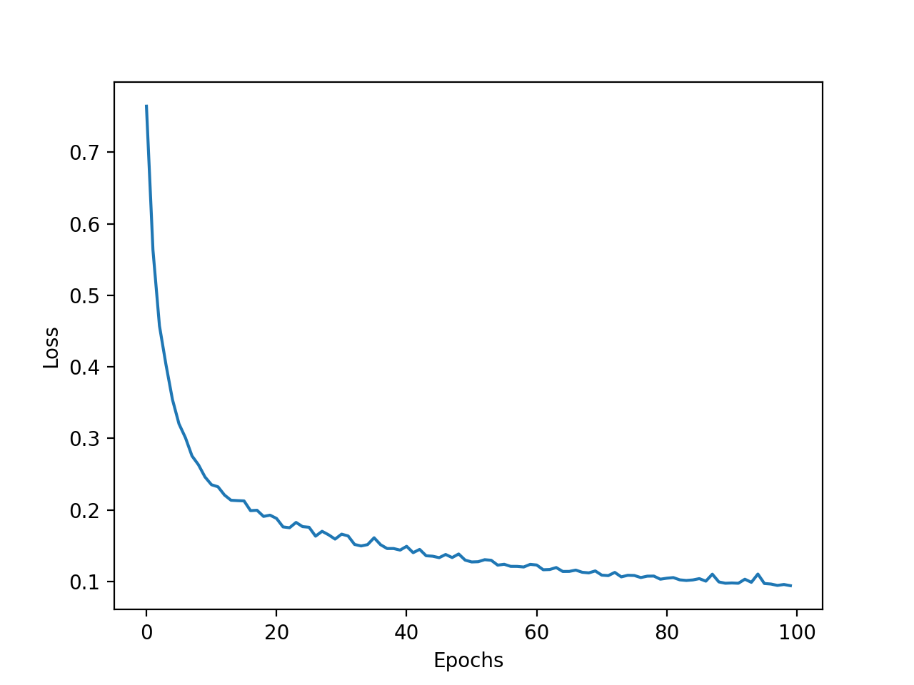
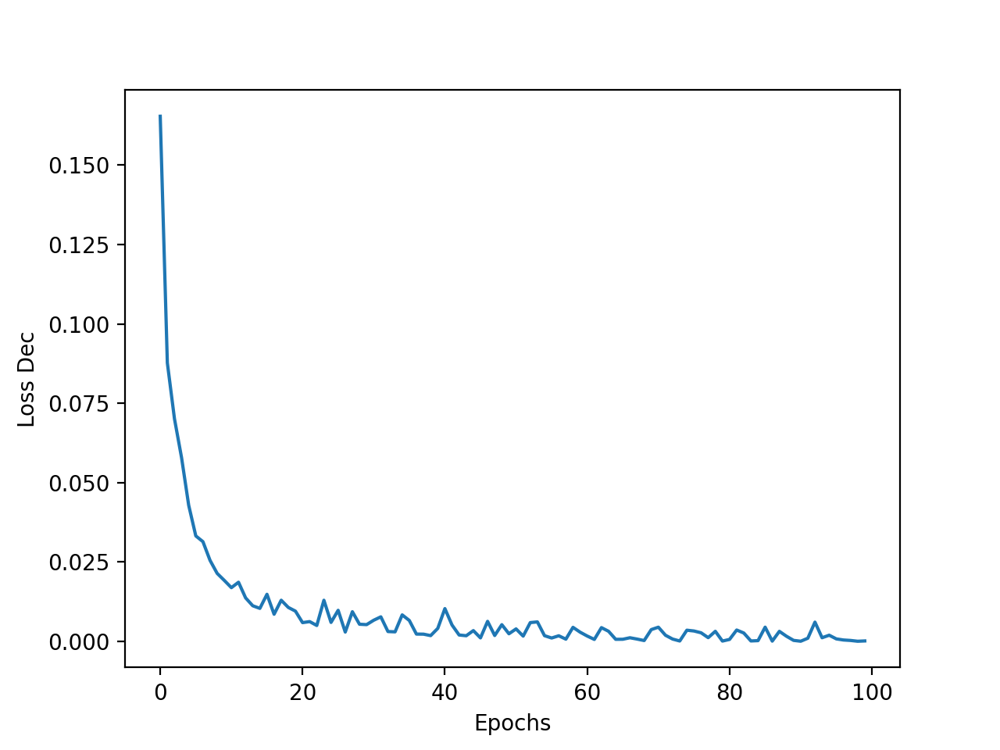
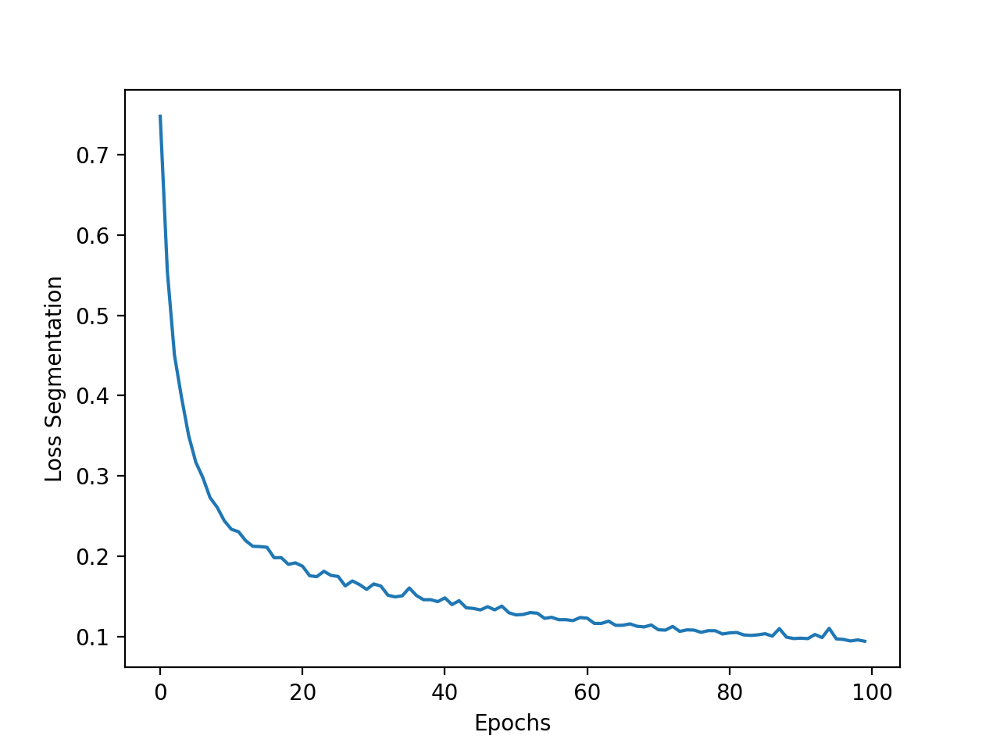
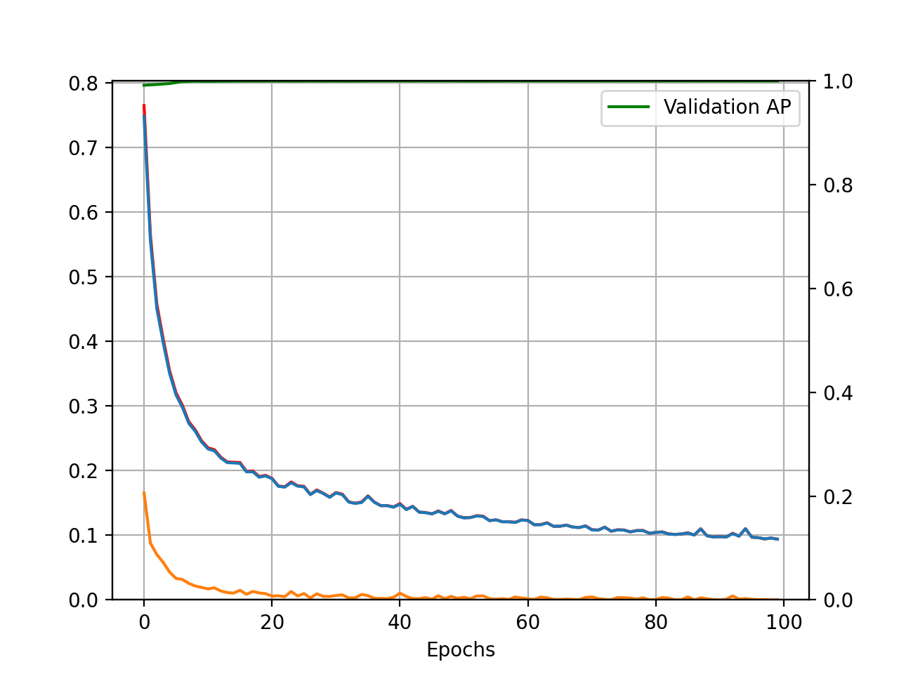
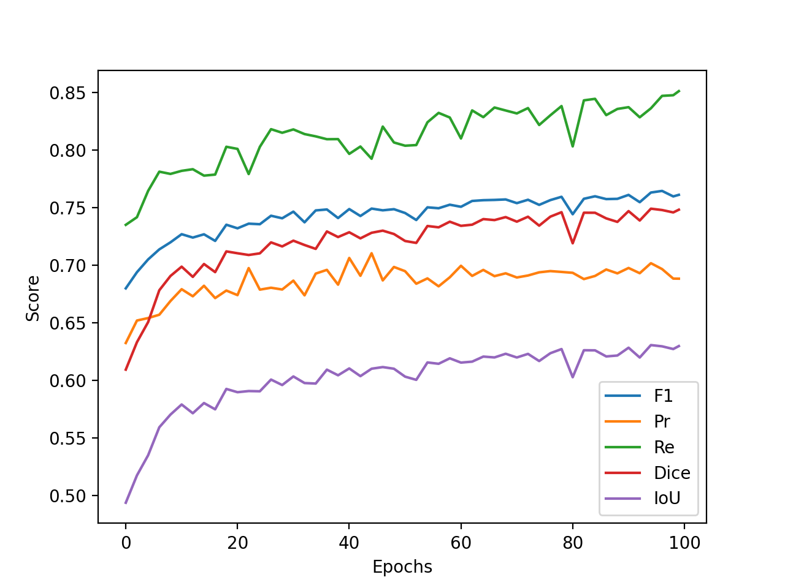

# Results of training on Sccdnet dataset

[Članek](https://www.mdpi.com/2076-3417/11/11/5074)

[Pregled vseh člankov](https://docs.google.com/spreadsheets/d/1AUmJ-JQtpvQt3Rs0maRirAxbBW6zBOBaPq1kVDSdvK0/edit?usp=sharing)

[Dataset](https://github.com/543630836/SCCDNet_crack)

## Dataset

| Parameter         | Value       |
| -----------       | ----------- |
| Input channels    | 3           |
| Input height      | 448         |
| Input width       | 448         |

| Set         | Positives   | Negatives   | Sum         |
| ----------- | ----------- | ----------- | ----------- |
| Train       | 4935        | 1229        | 6164        |
| Test        | 787         | 218         | 1005        |

## Run parameters

| Parameter                      | Value       |
| -----------                    | ----------- |
| Augmentation                   | True        |
| Batch size                     | 10          |
| BCE Loss weight                | True        |
| Best model type                | both        |
| Optimizer                      | Adam        |
| Learning rate                  | 0.001       |
| Delta CLS Loss                 | 0.1         |
| Epochs                         | 100         |
| Dilate                         | 1           |
| Weighted segmentation loss     | False       |
| Dynamically balanced loss      | False       |
| Gradien-flow adjustment        | True        |
| Frequency-of-use sampling      | False       |
| Validate                       | True        |
| Validate on test               | False       |
| Validataton N epochs           | 2           |
| Use best model                 | True        |
| Seg Black                      | True        |
| Thr Adjustment                 | 0.9         |

### Decision

| Run                  | Precision | Recall   | F1       | Accuracy | TP   | FP   | FN   | TN   |
| ---------------------| ----------| ---------| ---------|----------|------|------|------|------|
| Run 1                | 0.996183  | 0.994917 | 0.995550 | 0.993035 | 783  | 3    | 4    | 215  |
| Hard negative mining | 0.996825  | 0.999609 | 0.998215 | 0.997586 | 785  | 1    | 2    | 217  |
| 200 epoh             | 0.996825  | 0.999609 | 0.998215 | 0.997586 | 785  | 1    | 2    | 217  |

### Segmentation

| Run                  | Precision | Recall   | F1       | Dice     | IoU      |
| ---------------------| ----------| ---------| ---------|----------|----------|
| Run 1                | 0.690713  | 0.837305 | 0.763212 | 0.749184 | 0.630651 |
| Hard negative mining | 0.690812  | 0.837408 | 0.763837 | 0.749651 | 0.632198 |
| 200 epoh             | 0.700131  | 0.852362 | 0.768783 | 0.756156 | 0.638005 |

## Losses

### Loss

### Decision Loss

 

### Segmentation Loss

### Val Loss

### Scores

### Outputs

[Run 1](./sccdnet_6/sccdnet_6.out)

[Hard Negative Mining](./sccdnet_6/sccdnet_6hnm.out)